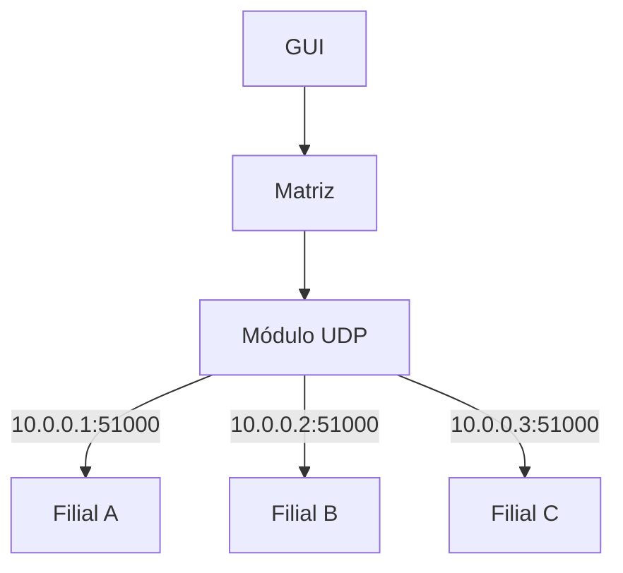
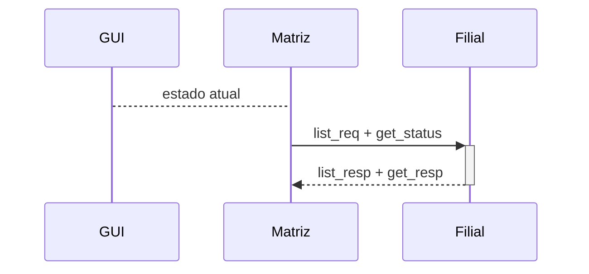
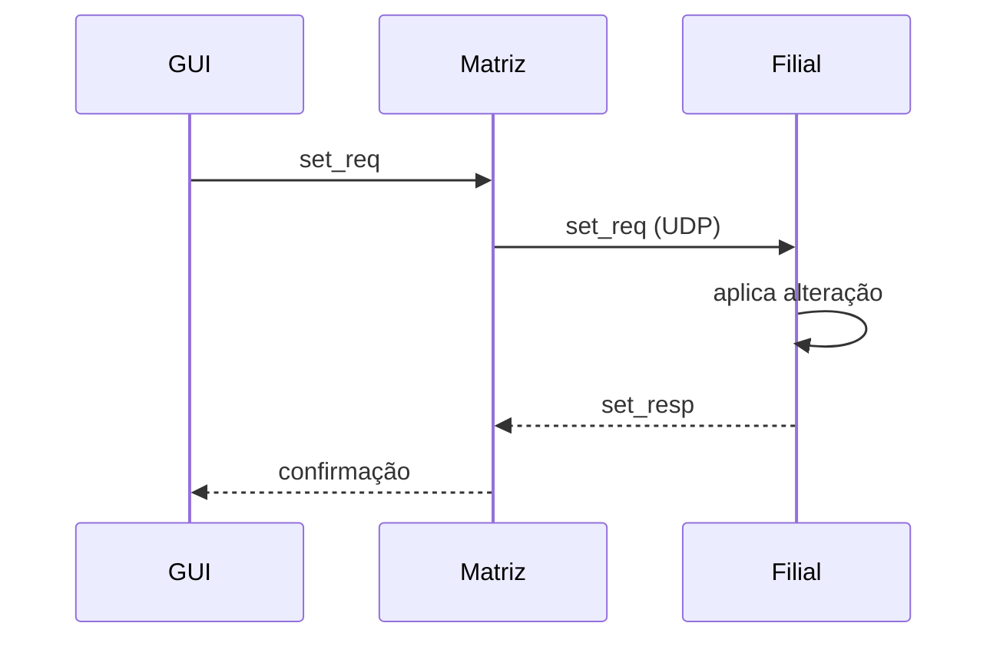

# Especificações Técnicas

## 1. Introdução

### 1.1 Contexto

Imagine que você trabalha em uma empresa de desenvolvimento de software e que em uma reunião com um dos clientes da empresa, este relata o seguinte problema:

> “...Temos diversas filiais e estamos tendo um gasto excessivo de energia elétrica por conta de luzes e aparelhos de ar-condicionado que se mantém ligados em horários os quais não há nenhum funcionário na empresa.
>  Gostaria de uma solução que nos permitisse monitorá-los, ligá-los e desligá-los remotamente...”

Diante deste relato, a sua gerente de PD&I solicita que você desenvolva uma solução que resolva o problema do cliente.

Ao planejá-la, você chega à conclusão de que precisará criar um software servidor que irá ser executado em cada filial e que terá sensores e atuadores ligados nele para a obtenção do estado e a realização de ações (a parte do sensoriamento e acionamento será abstraída do trabalho).

Ademais, será necessário criar um software cliente, que irá ser executado na matriz da empresa, e enviará solicitações de estado (verificar qual o estado de alguns dispositivos) e comandos (liga, desliga, altera o valor dos dispositivos) para que seja possível a realização do monitoramento e controle de forma remota.

Também se concluiu que por motivo de simplificação, o protocolo de transporte a ser utilizado deverá ser o UDP e que o layout dos dados contidos na camada de aplicação será baseado em JSON com codificação UTF-8.

### 1.2 Problema

> "Filiais com gasto excessivo de energia por luzes e ares-condicionados ligados fora do horário de trabalho."

### 1.3 Solução

Matriz envia comandos **UDP unicast** para filiais, que respondem com estado dos dispositivos. GUI web permite operação em tempo real.

Esse projeto pode ser implementado em qualquer linguagem de programação.

## 2. Arquitetura do Sistema

### 2.1 Entidades

| Entidade   | Papel    | Responsabilidade            |
| ---------- | -------- | --------------------------- |
| **Matriz** | Cliente  | Gerencia e controla filiais |
| **Filial** | Servidor | Expõe dispositivos via UDP  |

### 2.2 Diagrama




## 3. Protocolo de Comunicação

| Parâmetro    | Valor           | Observação             |
| ------------ | --------------- | ---------------------- |
| Transporte   | UDP             | unicast                |
| Formato      | JSON (UTF-8)    | Toda comunicação       |
| Autenticação | `user` + `pass` | Em **toda** requisição |
| Porta padrão | 51000           | Porta UDP              |

## 4. Dispositivos

### 4.1 Formato do ID

```
<tipo>_<dispositivo>_<local>
```

| Parte         | Valores               | Exemplo              |
| ------------- | --------------------- | -------------------- |
| `tipo`        | `sensor` / `actuator` | `actuator`           |
| `dispositivo` | `light` / `ac`        | `light`              |
| `local`       | string livre          | `sala`, `escritorio` |

**Exemplos**: `actuator_light_sala`, `sensor_ac_escritorio`

### 4.2 Tipos e Valores

| Tipo       | Acesso          | Luz     | AC     |
| ---------- | --------------- | ------- | ------ |
| `sensor`   | Somente leitura | boolean | 0–1023 |
| `actuator` | Somente Escrita | boolean | 0–1023 |

## 5. Comandos

Todos os comandos incluem `user` e `pass` em toda requisição.

### 5.1 `list_req` — Listar dispositivos

**Requisição:**
```json
{
  "cmd": "list_req",
  "user": "admin",
  "pass": "admin"
}
```

**Resposta:**
```json
{
  "cmd": "list_resp",
  "id": ["actuator_light_sala", "sensor_light_sala", "actuator_ac_escritorio"]
}
```

### 5.2 `get_status` — Estado atual

**Requisição:**
```json
{
  "cmd": "get_status",
  "user": "admin",
  "pass": "admin"
}
```

**Resposta:**
```json
{
  "cmd": "get_resp",
  "actuator_light_sala": true,
  "sensor_light_sala": false,
  "actuator_ac_escritorio": 720
}
```

### 5.3 `set_req` — Alterar estado

**Luz (boolean):**
```json
{
  "cmd": "set_req",
  "user": "admin",
  "pass": "admin",
  "id": "actuator_light_sala",
  "value": true
}
```

**Ar-condicionado (0–1023):**
```json
{
  "cmd": "set_req",
  "user": "admin",
  "pass": "admin",
  "id": "actuator_ac_escritorio",
  "value": 70
}
```

**Resposta:**
```json
{
  "cmd": "set_resp",
  "id": "actuator_light_sala",
  "value": true
}
```


## 6. Fluxo de Comunicação

### 6.1 Monitoramento



### 6.2 Controle



## 7. Requisitos Funcionais

### 7.1 Monitoramento
- Visualizar estado atual dos dispositivos por filial
- Obter lista de dispositivos da filial

### 7.2 Controle
- Ligar/desligar luzes
- Ajustar intensidade do ar-condicionado (0–1023)
- Feedback visual após alteração

### 7.3 Gerenciamento

- **Solicitações Periódicas**: Definir intervalo para atualização automática do estado dos dispositivos.
- **Gerenciar Filiais**: Adicionar/editar/remover com IP, porta
- **Filial**: Carregar configuração local (`config_filial.json`)

## 8. Configurações

### 8.1 `config_filial.json` (em cada filial)

```json
{
  "port": 51000,
  "admin_user": "test",
  "admin_pass": "test",
  "id": [
    "actuator_light_sala",
    "sensor_light_sala",
    "actuator_ac_escritorio",
    "sensor_ac_escritorio"
  ]
}
```

| Campo        | Tipo   | Descrição                          |
| ------------ | ------ | ---------------------------------- |
| `port`       | int    | Porta UDP de escuta (padrão 51000) |
| `admin_user` | string | Usuário para autenticar a matriz   |
| `admin_pass` | string | Senha para autenticar a matriz     |
| `id`         | array  | Lista de IDs de dispositivos       |

### 8.2 `config_matriz.json` (na matriz)

```json
{
  "user": "admin",
  "pass": "admin",
  "filiais": [
    { "name": "Filial Centro", "ip": "192.168.1.100", "port": 51000 },
    { "name": "Filial Norte",  "ip": "192.168.1.101", "port": 51000 }
  ]
}
```

| Campo     | Tipo   | Descrição                              |
| --------- | ------ | -------------------------------------- |
| `user`    | string | Credencial para todas as filiais       |
| `pass`    | string | Senha para todas as filiais            |
| `filiais` | array  | Lista de filiais: `name`, `ip`, `port` |

## 9. Ambiente de Teste

- Mínimo **2 filiais** com firmware
- **1 matriz** com software + GUI `(GUI da filial é opcional)`
- Cada filial com `config_filial.json` próprio
- Matriz conecta em todas simultaneamente
