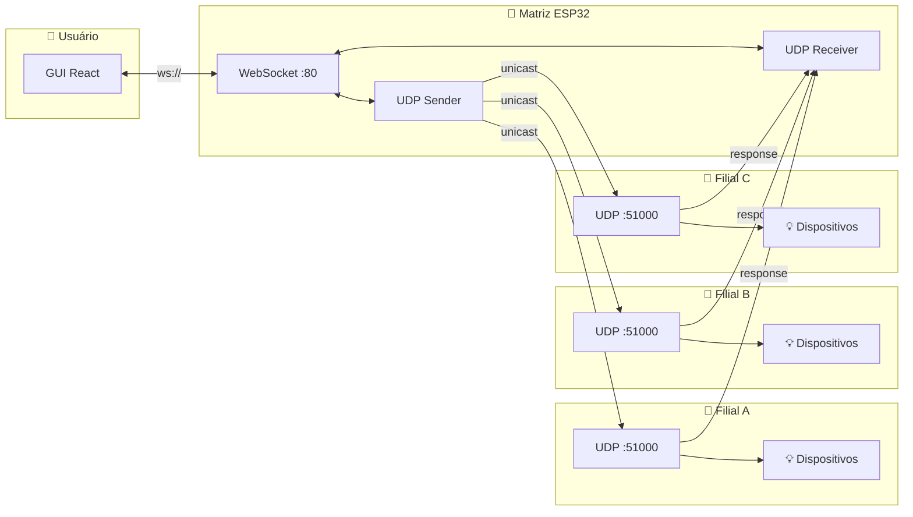
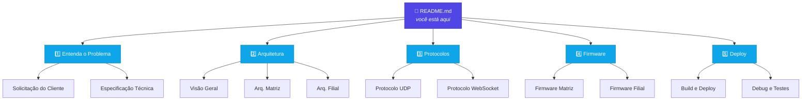

## Sobre o Projeto

Sistema de **monitoramento e controle remoto** de dispositivos IoT (luzes e ar-condicionado)
em múltiplas filiais, utilizando **ESP32**, **UDP**, **WebSocket** e uma **GUI React**.

## 🗺️ Arquitetura do Sistema

---

## 📚 Índice da Documentação

### 🏗️ Arquitetura

| Documento                                                          | Descrição                                                                    |
| ------------------------------------------------------------------ | ---------------------------------------------------------------------------- |
| [Visão Geral do Sistema](docusaurus/docs/architecture/overview.md) | Diagrama geral GUI ↔ Matriz ↔ Filial, fluxo de dados e resumo dos protocolos |
| [Arquitetura da Matriz](docusaurus/docs/architecture/matriz.md)    | Componentes internos: polling, bridge WebSocket, persistência e API REST     |
| [Arquitetura da Filial](docusaurus/docs/architecture/filial.md)    | Componentes internos: servidor UDP, processamento de comandos e GPIO         |

### 📡 Protocolos

| Documento                                                    | Descrição                                                                          |
| ------------------------------------------------------------ | ---------------------------------------------------------------------------------- |
| [Protocolo UDP](docusaurus/docs/protocol/udp.md)             | Especificação completa da comunicação Matriz ↔ Filial (JSON sobre UDP porta 51000) |
| [Protocolo WebSocket](docusaurus/docs/protocol/websocket.md) | Especificação da comunicação Matriz ↔ GUI (WebSocket porta 80)                     |

### 🔧 Firmware — Matriz

| Documento                                                                 | Descrição                                                                |
| ------------------------------------------------------------------------- | ------------------------------------------------------------------------ |
| [Firmware Matriz — Overview](docusaurus/docs/firmware/matriz/overview.md) | Modelo de dados, polling, descoberta automática e detecção offline       |
| [Firmware Matriz — REST API](docusaurus/docs/firmware/matriz/rest-api.md) | Endpoints REST: Wi-Fi, filiais (CRUD), status, descoberta e GUI estática |

### 🔧 Firmware — Filial

| Documento                                                                 | Descrição                                                                  |
| ------------------------------------------------------------------------- | -------------------------------------------------------------------------- |
| [Firmware Filial — Overview](docusaurus/docs/firmware/filial/overview.md) | Hierarquia de dispositivos, GPIO, processamento de comandos e autenticação |
| [Firmware Filial — REST API](docusaurus/docs/firmware/filial/rest-api.md) | Endpoints REST locais: Wi-Fi, configuração, dispositivos e captive portal  |

### 🖥️ GUI

| Documento                                                             | Descrição                                                              |
| --------------------------------------------------------------------- | ---------------------------------------------------------------------- |
| [GUI — Matriz Dashboard](docusaurus/docs/gui/matriz-gui.md)           | Arquitetura React, WebSocket, visualização de dispositivos e histórico |
| [GUI — Componentes e Dependências](docusaurus/docs/gui/components.md) | shadcn/ui, Tailwind, ícones e estrutura visual da interface            |

### 🌐 Infraestrutura

| Documento                                                         | Descrição                                                                  |
| ----------------------------------------------------------------- | -------------------------------------------------------------------------- |
| [Wi-Fi e Provisionamento](docusaurus/docs/infrastructure/wifi.md) | Modos STA/AP, captive portal, mDNS e fluxo de provisionamento              |
| [Configuração](docusaurus/docs/infrastructure/config.md)          | Arquivos JSON em LittleFS: `config_wifi`, `config_matriz`, `config_filial` |
| [Rede](docusaurus/docs/infrastructure/network.md)                 | Topologia, portas, mDNS e endereçamento IP                                 |

### ⚙️ DevOps

| Documento                                                 | Descrição                                                                  |
| --------------------------------------------------------- | -------------------------------------------------------------------------- |
| [Build e Deploy](docusaurus/docs/devops/build-deploy.md)  | Makefile, PlatformIO, pnpm/Vite, upload LittleFS e procedimentos de deploy |
| [Debug e Testes](docusaurus/docs/devops/debug-testing.md) | Serial monitor, logging, testes e ferramentas de troubleshooting           |

---

## 📂 Especificações Detalhadas

Estes documentos contêm especificações executáveis com maior profundidade técnica.

| Documento                                                     | Descrição                                      |
| ------------------------------------------------------------- | ---------------------------------------------- |
| [Matriz ESP32](docusaurus/docs/matriz.md)                     | Especificação completa do firmware da Matriz   |
| [GUI da Matriz](docusaurus/docs/matriz-gui.md)                | Especificação completa da interface web        |
| [Filial ESP32](docusaurus/docs/filial.md)                     | Especificação completa do firmware da Filial   |
| [Configuração, Rede e Build](docusaurus/docs/config-build.md) | Configuração de ambiente, rede, build e deploy |

---

## 🗂️ Mapa de Navegação

### 📋 Projeto e Requisitos

---

| Documento                                                | Descrição                                         |
| -------------------------------------------------------- | ------------------------------------------------- |
| [Solicitação do Cliente](docusaurus/docs/solicitacao.md) | Problema relatado e escopo original do projeto    |
| [Especificação Técnica](docusaurus/docs/requisitos.md)   | Requisitos funcionais e não-funcionais detalhados |
| [Definições Técnicas](docusaurus/docs/definicoes.md)     | Glossário, acrônimos e definições de domínio      |
| [Fluxos](docusaurus/docs/fluxos.md)                      | Fluxos de dados e comunicação do sistema          |

---

## 🚀 Como Começar

1. **Entenda o problema** —
   [Solicitação do Cliente](docusaurus/docs/solicitacao.md) ·
   [Especificação Técnica](docusaurus/docs/requisitos.md)
2. **Visão geral** —
   [Arquitetura — Visão Geral](docusaurus/docs/architecture/overview.md)
3. **Protocolos** —
   [UDP](docusaurus/docs/protocol/udp.md) ·
   [WebSocket](docusaurus/docs/protocol/websocket.md)
4. **Firmware** —
   [Matriz](docusaurus/docs/firmware/matriz/overview.md) ·
   [Filial](docusaurus/docs/firmware/filial/overview.md)
5. **Deploy** —
   [Build e Deploy](docusaurus/docs/devops/build-deploy.md)

