<!-- markdownlint-disable-file MD013 MD022 MD026 MD031 MD032 MD036 MD040 MD012 -->

# UDP IoT Monitoramento

## 1. Introdução

### 1.1 Contexto

Ema empresa com várias filiais espalhadas pela cidade está gastando muito dinheiro sendo desperdiçado com energia elétrica.

> Luzes ficam ligadas durante a noite (quando não tem ninguém trabalhando)
> Ar-condicionados continuam funcionando nos finais de semana
> Ninguém na matriz sabe o que está acontecendo em cada filial em tempo real
> Cada filial funciona de forma independente, sem controle centralizado

**Solução:** Um sistema IoT que permite monitorar e controlar tudo remotamente, direto de um computador na matriz.

### 1.2 Visão Geral

**1.2.1 Matriz**

- Um ESP32 rodando na matriz da empresa
- Serve um site (dashboard) para os Usuárioes
- Manda comandos para todas as filiais via WiFi
- Recebe os dados de todas as filiais em tempo real

**1.2.2 Filiais**
- Cada filial tem seu próprio ESP32
- Conectado a sensores (para ver o que está acontecendo)
- Conectado a atuadores (para ligar/desligar equipamentos)
- Recebe comandos da matriz e executa ações
- Também expõe um portal local de configuração e diagnóstico
- Esse portal é acessado apenas na rede da própria filial e não substitui o dashboard central

**1.2.3 GUI da Filial**
- Interface local simples, servida pelo ESP32 da filial
- Usada para configurar Wi-Fi, credenciais, IP e parâmetros básicos de operação
- Exibe o status dos sensores e atuadores daquela filial
- Serve para manutenção e testes locais, não para operação centralizada
- É carregada do LittleFS da filial e atendida via HTTP/REST na porta 80

**1.2.4 Interface Web**
- Um site moderno feito em React
- Mostra o status de todas as filiais em tempo real
- Permite ligar/desligar luzes e ar-condicionado com um clique
- Atualiza automaticamente sem precisar dar refresh
- A GUI final é servida pela Matriz via LittleFS

## 2. Estrutura

### 2.1 Entidades do Sistema

#### 2.1.1 Matriz

- Gerencia todas as filiais remotamente
- Serve o dashboard web para os Usuárioes
- Envia comandos via rede WiFi
- Recebe atualizações em tempo real

**Tecnologias:**

- Hardware: ESP32 (microcontrolador com WiFi)
- Software: AsyncWebServer (servidor web) + WebSocket (comunicação em tempo real)
- Função na rede: Cliente UDP (quem **faz** os pedidos)

#### 2.1.2 Filial

- Controla luzes e ar-condicionado localmente
- Lê sensores para saber o status atual
- Responde aos comandos da matriz
- Serve um portal local para configuração e diagnóstico

**Tecnologias:**
- Hardware: ESP32 com GPIOs conectados a sensores e atuadores
- Software: WiFiUDP (comunicação) + WebServer/AsyncWebServer + LittleFS
- Função na rede: Servidor UDP (quem **responde** aos pedidos) e servidor HTTP local da própria filial

#### 2.1.3 Dashboard Web

- Mostra todas as filiais em cards visuais
- Permite ligar/desligar dispositivos com um clique
- Atualiza status em tempo real (sem refresh)
- Permite adicionar/editar filiais

**Tecnologias:**
- React 19 (framework moderno)
- Vite (build rápido)
- shadcn/ui (componentes bonitos)
- WebSocket (para atualizações instantâneas)

### 2.2 Fluxo de Comunicação

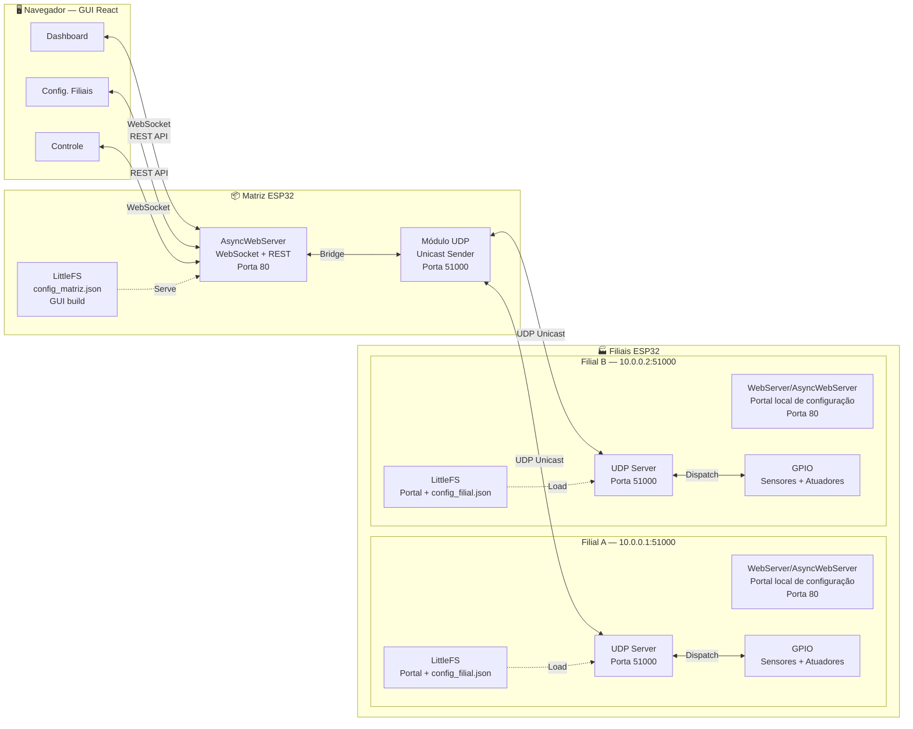

> Cada filial é independente — gerencia seus próprios dispositivos e não
> depende das demais. A Matriz atua como _hub_ centralizador, mas cada
> filial também pode servir sua GUI local para configuração e diagnóstico
> sem interferir no dashboard central.

### 2.3 Protocolos de Comunicação

#### 2.3.1 UDP (Matriz ↔ Filial)

- **Muito rápido** não perde tempo criando conexão
- **Fire-and-forget** envia e esquece (sem garantia de entrega)
- **Unicast** envia para um endereço específico
- **Porta:** 51000
- **Formato:** JSON (texto puro)
- **Segurança:** `user` e `pass` em cada mensagem
- **Confiabilidade:** fire-and-forget, sem ACK obrigatório


#### 2.3.2 WebSocket (ESP32 ↔ Navegador)

- **Bidirecional** navegador E servidor podem enviar mensagens
- **Tempo real** atualiza instantaneamente
- **Porta:** 80 (mesma do HTTP)
- **Formato:** JSON
- **Reconexão automática** se cair, tenta reconectar sozinho
- **Uso principal:** atualização de estado e controle em tempo real da GUI da Matriz

#### 2.3.3 HTTP REST (ESP32 ↔ Navegador)

- **Request-Response** pergunta e resposta
- **CRUD** Create, Read, Update, Delete
- **Porta:** 80
- **Formato:** JSON
- **Sem autenticação** rede local confiável
- **Uso principal:** interface local de configuração e diagnóstico da filial

**Quando usar cada um:**
- GET = Ler configuração
- POST = Criar nova filial
- PUT = Atualizar configuração
- DELETE = Remover filial

### 2.4 Visão Geral dos Protocolos

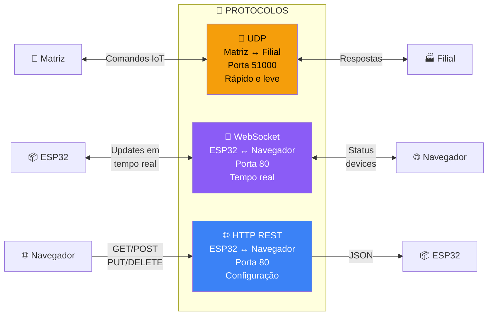

### 2.5 Fluxo de Comunicação UDP

Comunicação entre Matriz e Filial:

1. **Descoberta:** Recebe a lista de dispositivos das filiais"
2. **Monitoramento:** A cada intervalo global configurado a Matriz atualiza o status de todos os dispositivos
3. **Controle:** Quando Usuário clica, matriz envia comando "altere para X"
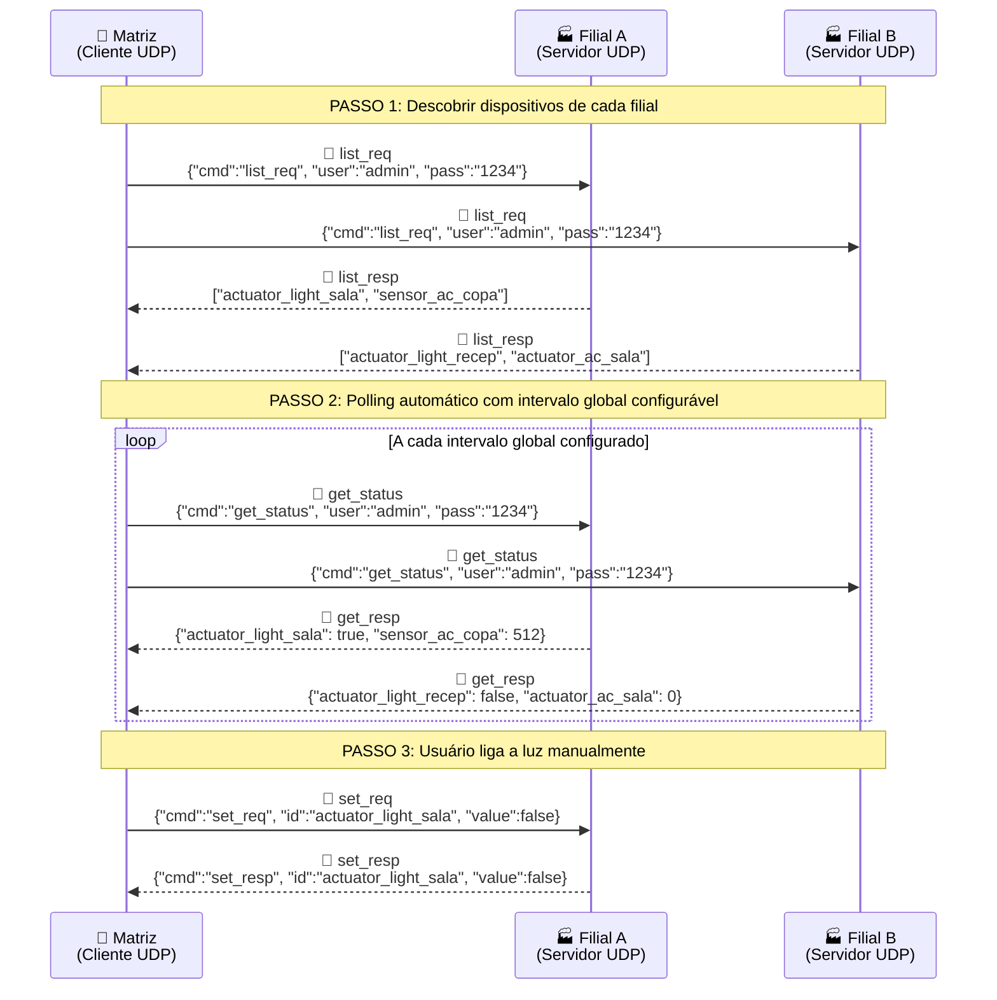

### 2.6 WebSocket

- **Reconexão automática:** Se WebSocket cair, tenta reconectar sozinho
- **Broadcast:** Uma atualização é enviada para TODAS as abas abertas
- **Exponential backoff:** 1s → 2s → 4s → 8s → até 30s entre tentativas

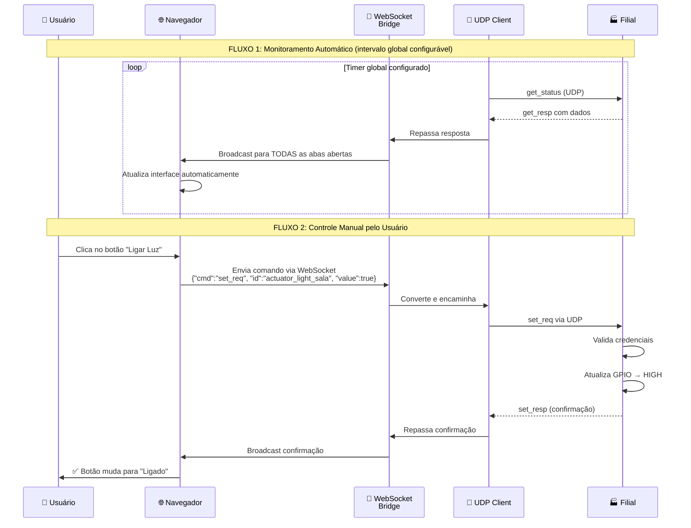

### 2.7 Exemplo Prático: Ligando uma Luz

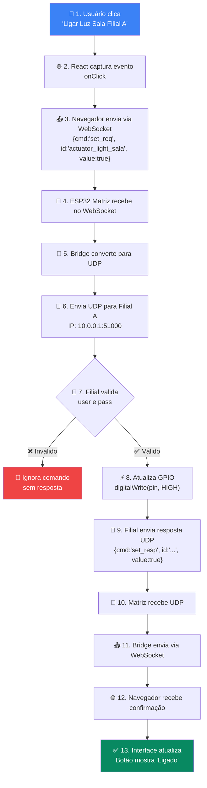

## 3. Comunicação UDP

### 3.1 Padrão de Comunicação

Todas as mensagens UDP seguem o formato JSON e incluem autenticação. O campo `cmd` define qual ação será executada.

**Formato básico:**
```json
{
  "cmd": "nome_do_comando",
  "user": "admin",
  "pass": "1234",
  ...outros campos...
}
```

### 3.2 Comandos Principais

#### LIST (Listar Dispositivos)

Descobre quais dispositivos a filial possui

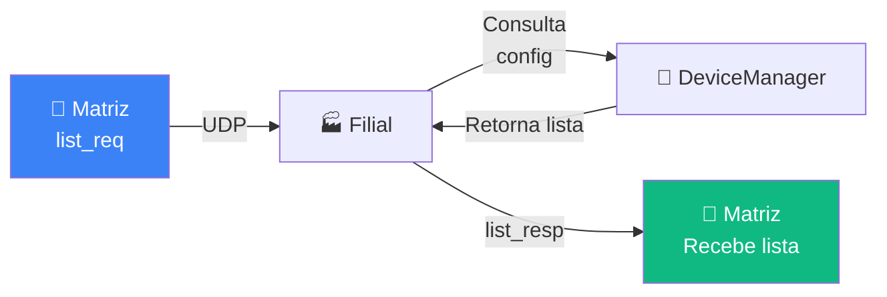

**Requisição (Matriz → Filial):**
```json
{
  "cmd": "list_req",
  "user": "admin",
  "pass": "1234"
}
```

**Resposta (Filial → Matriz):**
```json
{
  "cmd": "list_resp",
  "id": [
    "actuator_light_sala",
    "sensor_light_sala",
    "actuator_ac_escritorio",
    "sensor_ac_escritorio"
  ]
}
```

#### GET_STATUS (Ler Estado Atual)

Lê o estado atual de TODOS os dispositivos

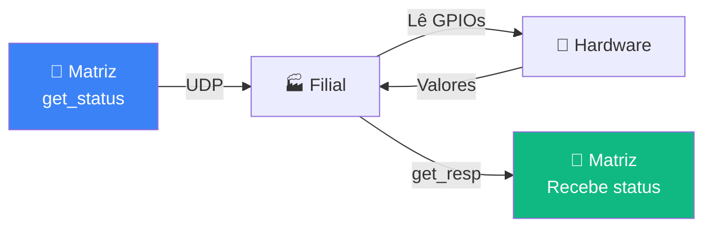

**Requisição (Matriz → Filial):**
```json
{
  "cmd": "get_status",
  "user": "admin",
  "pass": "1234"
}
```

**Resposta (Filial → Matriz):**
```json
{
  "cmd": "get_resp",
  "actuator_light_sala": true,
  "sensor_light_sala": false,
  "actuator_ac_escritorio": 72,
  "sensor_ac_escritorio": 45
}
```

**Lendo a resposta:**
- `true` = luz está **ligada** 💡
- `false` = luz está **desligada**
- `72` = intensidade do ar-condicionado em porcentagem (0-100) ❄️
- `45` = leitura do sensor de ar em porcentagem (0-100) 📊

#### SET (Alterar Estado)

Muda o estado de UM dispositivo específico

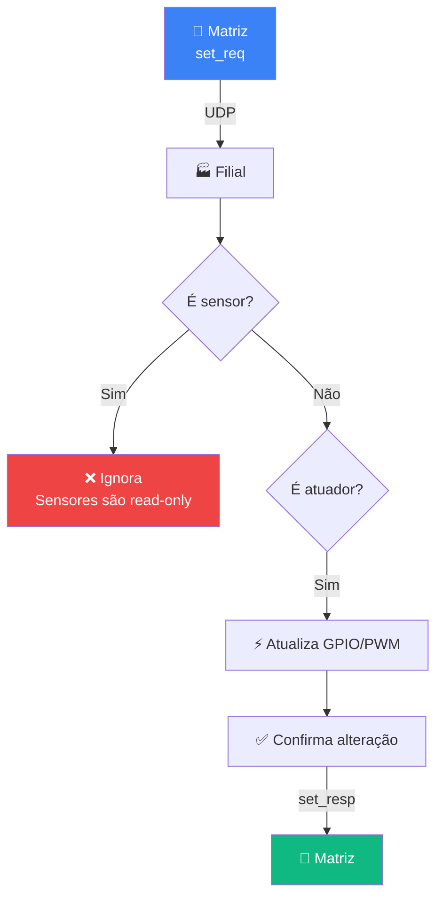

**Requisição para LIGAR uma luz:**
```json
{
  "cmd": "set_req",
  "user": "admin",
  "pass": "1234",
  "id": "actuator_light_sala",
  "value": true
}
```

**Requisição para ajustar ar-condicionado:**
```json
{
  "cmd": "set_req",
  "user": "admin",
  "pass": "1234",
  "id": "actuator_ac_escritorio",
  "value": 70
}
```

**Resposta de confirmação:**
```json
{
  "cmd": "set_resp",
  "id": "actuator_light_sala",
  "value": true
}
```

> Tentar alterar um `sensor`, o comando é **ignorado silenciosamente** (sem erro).

### 3.3 IDs dos Dispositivos

Cada dispositivo tem um ID único no formato:
```
<tipo>_<dispositivo>_<local>
```

**Exemplos práticos:**

| ID Completo              | Tipo       | Dispositivo | Local        | O que faz                    |
| ------------------------ | ---------- | ----------- | ------------ | ---------------------------- |
| `actuator_light_sala`    | `actuator` | `light`     | `sala`       | Controla a luz da sala       |
| `sensor_light_sala`      | `sensor`   | `light`     | `sala`       | Verifica se luz está ligada  |
| `actuator_ac_escritorio` | `actuator` | `ac`        | `escritorio` | Controla ar do escritório    |
| `sensor_ac_escritorio`   | `sensor`   | `ac`        | `escritorio` | Lê temperatura do escritório |

- `actuator_*` = Pode **escrever** via `set_req` (controle)
- `sensor_*` = Pode apenas **ler** (monitorar)
- Estados de `sensor_*` e `actuator_*` são observados via `get_status`
- Valores de AC são sempre representados em porcentagem na API e na GUI

### 3.4 Tipos de Dispositivos e Valores

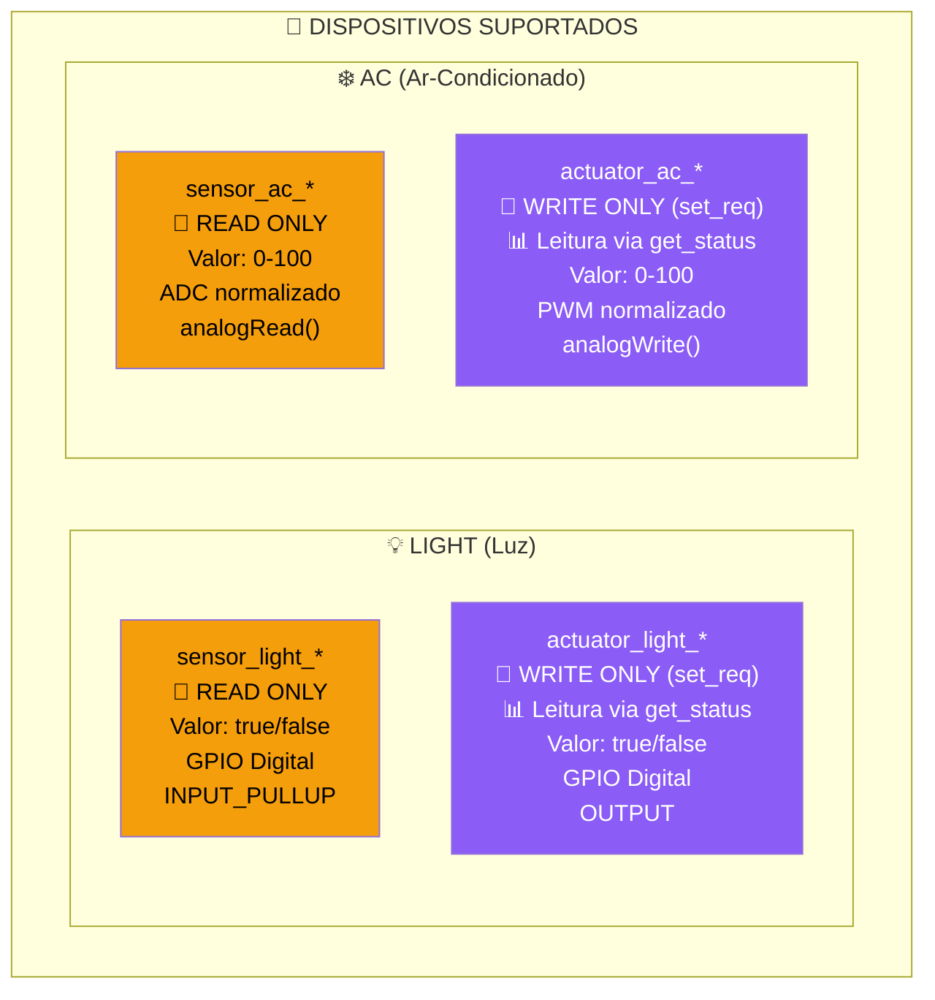

**Tabela de Valores:**

- **Light (Luz):**
  - `sensor_light_*`: Booleano (`true` = ligada, `false` = desligada)
  - `actuator_light_*`: Booleano (`true` = ligar, `false` = desligar)

- **AC (Ar-Condicionado):**
  - `sensor_ac_*`: Inteiro 0–100 (porcentagem da leitura do sensor)
  - `actuator_ac_*`: Inteiro 0–100 (intensidade do ar: 0=desligado, 100=máximo)

## 4. Arquitetura Interna da Matriz

### 4.1 Funcionamento

- Gerenciar múltiplas filiais simultaneamente
- Servir o site (dashboard) para os Usuárioes
- Fazer a ponte entre WebSocket e UDP
- Armazenar configurações

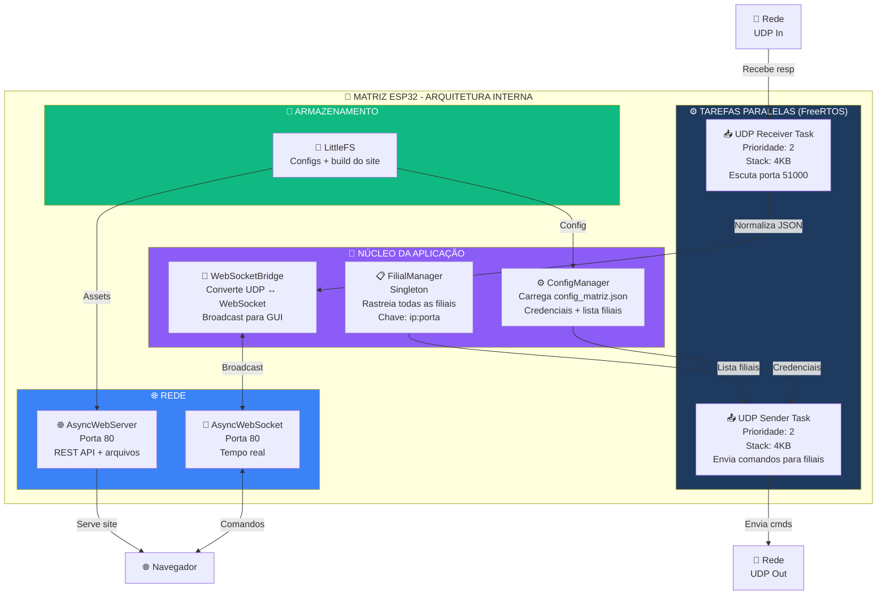

### 4.2 Limites do Sistema

O ESP32 tem recursos limitados (~320KB RAM livre).

| Constante           | Valor | Justificativa                                         |
| ------------------- | ----- | ----------------------------------------------------- |
| `MAX_FILIAIS`       | 10    | ~1KB para config+state. Razóavel para pequena empresa |
| `MAX_DEVICES`       | 8     | Por filial. Mantém a resposta UDP curta e previsível  |
| `POLLING_MIN`       | 5s    | Evita sobrecarga de rede                              |
| `POLLING_MAX`       | 120s  | Mantém relevância dos dados                           |
| `POLLING_DEFAULT`   | 30s   | Equilíbrio entre responsividade e economia de banda   |
| `OFFLINE_THRESHOLD` | 3     | Ciclos consecutivos sem resposta para marcar offline  |

### 4.3 Gerenciamento de Filiais

#### 4.3.1 Configuração Estática (`FilialConfig`)

**Arquivo:** `config_matriz.json`
Editável via GUI ou manualmente no LittleFS. Este é o contrato oficial da Matriz.

```cpp
struct FilialConfig {
  String name;         // Exemplo: "Filial Centro"
  String ip;           // Exemplo: "10.0.0.1"
  uint16_t port;       // Exemplo: 51000
};
```

**Exemplo:**
```json
{
  "name": "Filial Centro",
  "ip": "10.0.0.1",
  "port": 51000
}
```

#### 4.3.2 Estado Dinâmico (`FilialState`)

A matriz mantém o estado de cada filial para saber se está online ou offline:

```cpp
struct FilialState {
  String name;         // Nome da filial (vem do list_resp)
  uint32_t lastSeen;   // Timestamp da última resposta (millis())
  bool online;         // true se lastSeen < (3 * pollingIntervalMs)
};
```

#### 4.3.3 Descoberta e Cadastro de Filiais

- A lista base de filiais vem de `config_matriz.json`
- A GUI da Matriz pode adicionar, editar e remover filiais em runtime
- Mudanças persistem em LittleFS e passam a valer no próximo ciclo de polling
- Não há descoberta automática obrigatória nesta versão

### 4.4 Detecção de Online/Offline

A matriz usa um sistema inteligente para saber se a filial está viva:

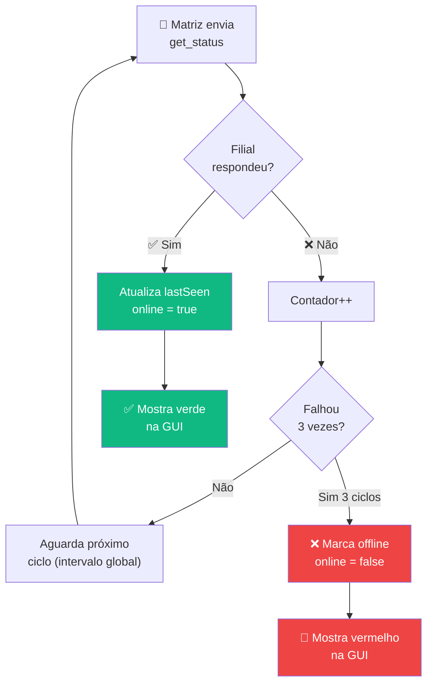

**Regras:**
- ✅ **Online:** Respondeu nos últimos 3 ciclos de polling global
- ❌ **Offline:** Não responde por 3 ciclos consecutivos
- 🔄 **Recuperação automática:** Assim que responder novamente, volta para online

### 4.5 Adicionando Filiais em Runtime

Adicionar novas filiais **sem reiniciar** a Matriz:

1. Usuário preenche formulário na GUI
2. GUI envia JSON via REST API
3. ConfigManager salva no LittleFS
4. FilialManager recarrega a lista
5. Próximo polling já inclui a nova filial!

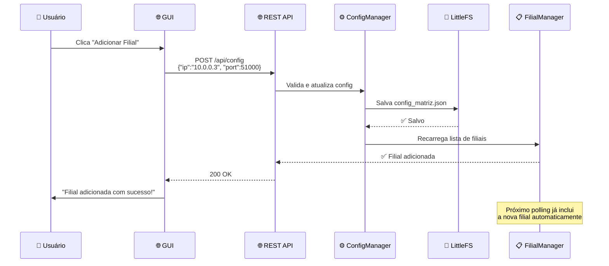

## 5. Arquitetura Interna da Filial

### 5.1 Funcionamento

- Escuta comandos UDP na porta 51000
- Executa ações nos GPIOs (ligar/desligar, ler sensores)
- Responde com o resultado
- Serve uma GUI local (opcional, para debug)
- Comando desconhecido ou inválido é ignorado sem resposta

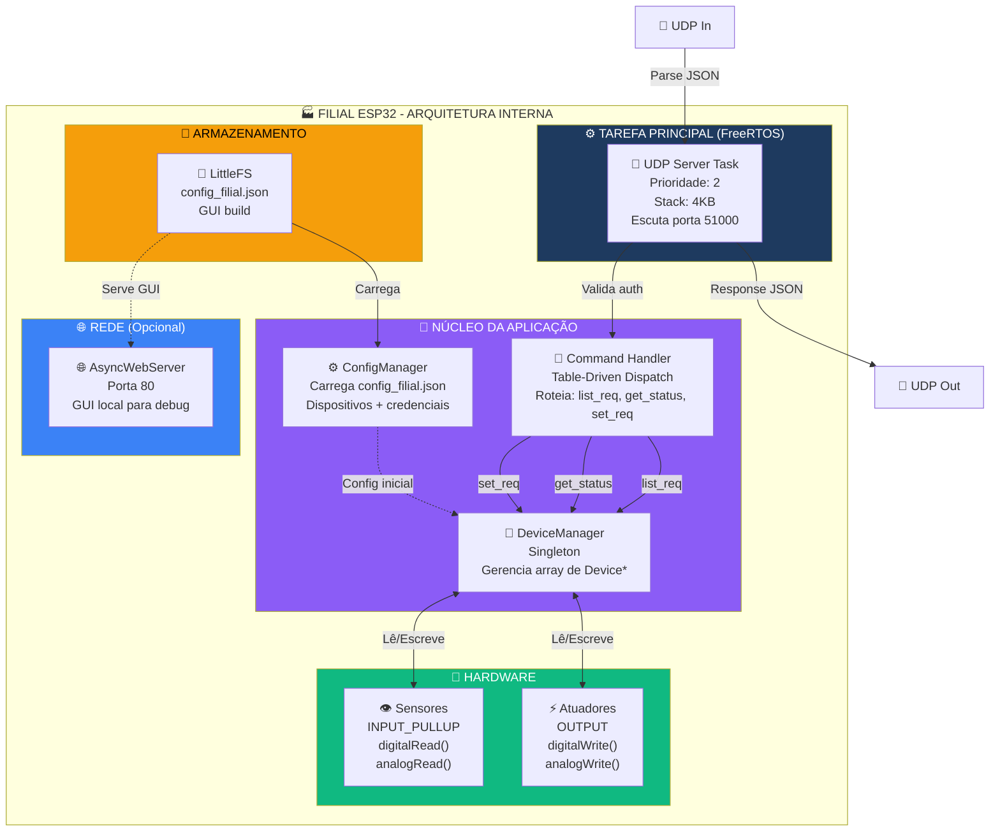

### 5.2 Pipeline de Processamento

Quando um comando UDP chega, ele passa por várias etapas:

1. **Recebe UDP:** Bytes chegam na porta 51000
2. **Parse JSON:** Converte bytes para objeto JSON
3. **Valida credenciais:** Compara `user` e `pass` com o config
4. **Dispatch:** Olha o campo `cmd` e decide qual função chamar
5. **Executa:** Chama a função apropriada
6. **Responde:** Monta JSON e envia de volta

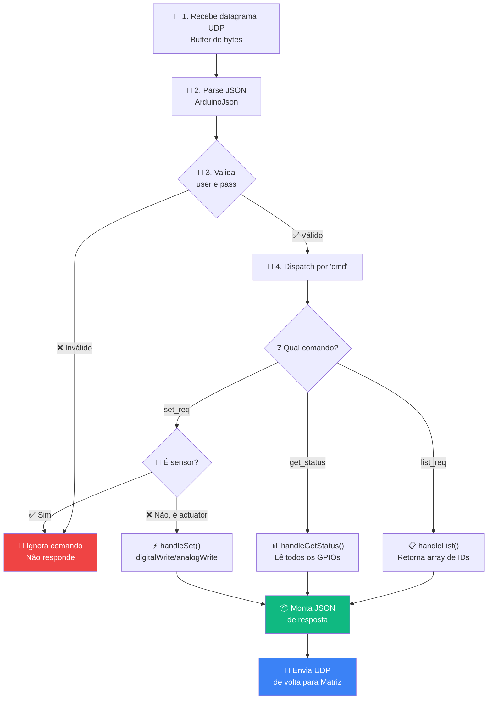

### 5.3 Table-Driven Dispatch

Em vez de usar vários `if/else`, usamos uma **tabela de dispatch**:

```cpp
// Tabela que mapeia comando → função
typedef void (*CommandHandler)(JsonDocument& req, JsonDocument& resp);

struct CommandEntry {
  const char* cmd;
  CommandHandler handler;
};

CommandEntry commandTable[] = {
  {"list_req",   handleList},
  {"get_status", handleGetStatus},
  {"set_req",    handleSet}
};

// Busca na tabela e executa
void dispatchCommand(const char* cmd, JsonDocument& req, JsonDocument& resp) {
  for (auto& entry : commandTable) {
    if (strcmp(entry.cmd, cmd) == 0) {
      entry.handler(req, resp);  // Executa função
      return;
    }
  }
  // Comando desconhecido: ignora
}
```

### 5.4 Gerenciamento de Dispositivos

O `DeviceManager` mantém um array com todos os dispositivos (máximo `MAX_DEVICES = 8`):

```cpp
class DeviceManager {
private:
  Device* devices[MAX_DEVICES];  // Array de ponteiros (máx 8)
  int deviceCount;

public:
  // Lista todos os IDs
  void listDevices(JsonArray& out);

  // Lê estado de todos
  void getStatus(JsonObject& out);

  // Altera um dispositivo específico
  bool setValue(const char* id, int value);
};
```

**Hierarquia de classes:**

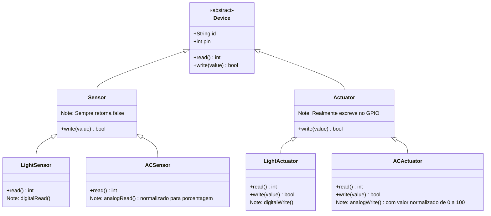

**Polimorfismo em ação:**
```cpp
// Todos os dispositivos seguem a mesma interface
for (Device* dev : devices) {
  int value = dev->read();        // Funciona para qualquer tipo!
  bool ok = dev->write(newValue); // Sensores retornam false
}
```

## 6. Stack Técnica

### 6.1 Hardware

- **Microcontrolador:** ESP32 DevKit V1
- **CPU:** Dual-core 240 MHz (2 cores)
- **Memória Flash:** 4 MB (para guardar código + configs + site)
- **WiFi:** 2.4 GHz (conecta na rede local)

### 6.2 Software - Bibliotecas ESP32

Todas as dependências são gerenciadas pelo **PlatformIO** (arquivo `platformio.ini`):

#### Para a Matriz:
```ini
[env:matriz]
platform = espressif32
board = esp32doit-devkit-v1
framework = arduino

lib_deps =
    # Servidor web assíncrono (não trava o código)
    ESP32Async/ESP Async WebServer@^3.6.0

    # TCP assíncrono (para WebSocket funcionar)
    ESP32Async/AsyncTCP@^3.3.2

    # Parser JSON super leve e rápido
    bblanchon/ArduinoJson@^7.4.3
```

#### Para a Filial:
```ini
[env:filial]
platform = espressif32
board = esp32doit-devkit-v1
framework = arduino

lib_deps =
    # Parser JSON
    bblanchon/ArduinoJson@^7.4.3

    # Servidor web (para GUI local opcional)
    ESP32Async/ESP Async WebServer@^3.6.0
    ESP32Async/AsyncTCP@^3.3.2
```

**Bibliotecas nativas (já incluídas no ESP32):**
- `WiFi.h` - Conectar no WiFi
- `WiFiUDP.h` - Comunicação UDP
- `LittleFS.h` - Sistema de arquivos na flash

### 6.3 Frontend (Interface Web)

- **React 19:** Framework TypeScript
- **Vite:** Build
- **shadcn/ui:** Componentes
- **TailwindCSS:** Estilização utilitária
- **pnpm:** Gerenciador de pacotes
- **TanStack Query (react-query):** Gerenciamento de estado (se adotado na GUI)

### 6.4 Sistema de Arquivos

O ESP32 usa **LittleFS** - um sistema de arquivos otimizado para memória flash:

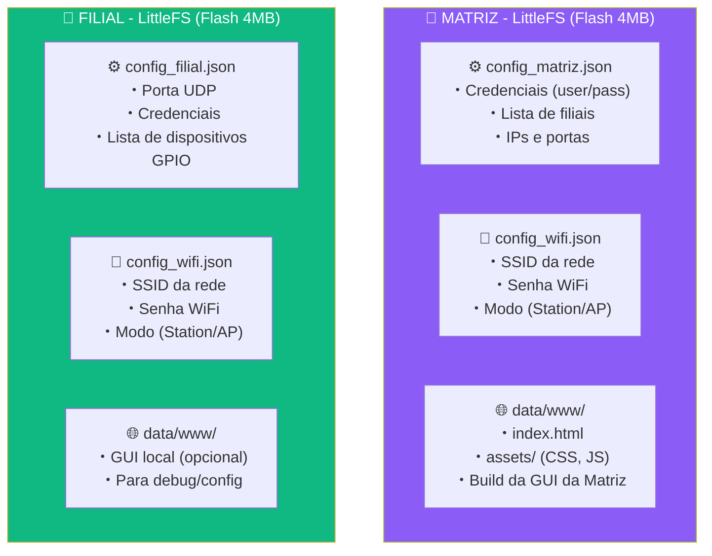

**Exemplo de `config_matriz.json`:**
```json
{
  "user": "admin",
  "pass": "1234",
  "polling_interval": 30,
  "filiais": [
    {
      "name": "Filial Centro",
      "ip": "10.0.0.1",
      "port": 51000
    },
    {
      "name": "Filial Norte",
      "ip": "10.0.0.2",
      "port": 51000
    }
  ]
}
```

**Exemplo de `config_filial.json`:**
```json
{
  "port": 51000,
  "user": "admin",
  "pass": "1234",
  "devices": [
    {
      "id": "actuator_light_sala",
      "type": "actuator",
      "device": "light",
      "pin": 2
    },
    {
      "id": "sensor_light_sala",
      "type": "sensor",
      "device": "light",
      "pin": 4
    },
    {
      "id": "actuator_ac_escritorio",
      "type": "actuator",
      "device": "ac",
      "pin": 25
    }
  ]
}
```
