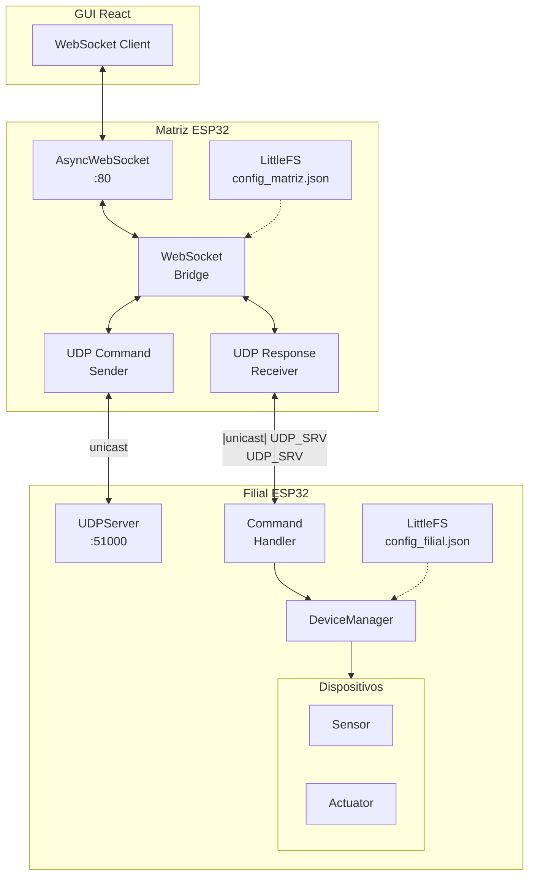
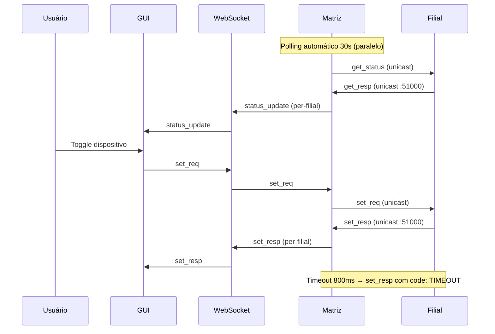
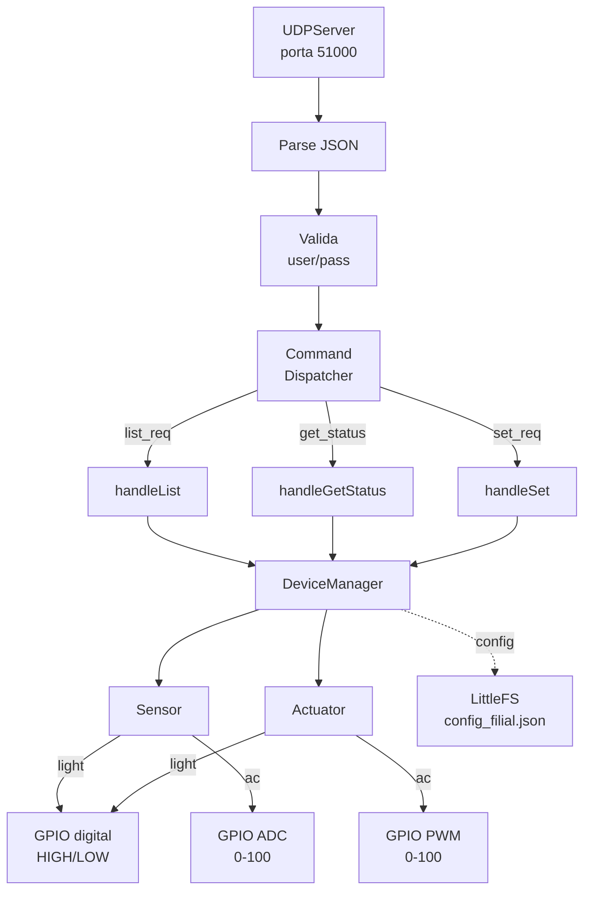
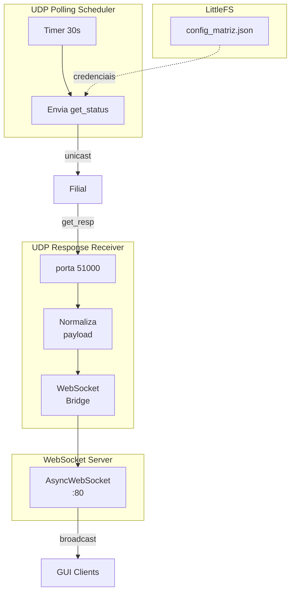

## Arquitetura do sistema

## Visão geral

```mermaid
flowchart TB
    subgraph GUI["GUI React"]
        WS[WebSocket Client]
    end

    subgraph MATRIZ["Matriz ESP32"]
        WS_SRV[AsyncWebSocket<br/>:80]
        UDP_SENDER[UDP Command<br/>Sender]
        UDP_RECV[UDP Response<br/>Receiver]
        BRIDGE[WebSocket<br/>Bridge]
        LFS_MATRIZ[LittleFS<br/>config_matriz.json]
    end

    subgraph FILIAL["Filial ESP32"]
        UDP_SRV[UDPServer<br/>:51000]
        HANDLER[Command<br/>Handler]
        DEV_MGR[DeviceManager]
        LFS_FILIAL[LittleFS<br/>config_filial.json]

        subgraph DEVICES["Dispositivos"]
            SENS[Sensor]
            ACT[Actuator]
        end
    end

    WS <--> WS_SRV
    WS_SRV <--> BRIDGE
    BRIDGE <--> UDP_SENDER
    BRIDGE <--> UDP_RECV
    UDP_SENDER <-->|unicast| UDP_SRV
    UDP_RECV <--|unicast| UDP_SRV
    UDP_SRV --> HANDLER
    HANDLER --> DEV_MGR
    DEV_MGR --> DEVICES
    LFS_FILIAL -.-> DEV_MGR
    LFS_MATRIZ -.-> BRIDGE
```

## Fluxo de dados

```mermaid
sequenceDiagram
    participant U as Usuário
    participant G as GUI
    participant WS as WebSocket
    participant M as Matriz
    participant F as Filial

    Note over M: Polling automático 30s (paralelo)

    M->>F: get_status (unicast)
    F->>M: get_resp (unicast :51000)
    M->>WS: status_update (per-filial)
    WS->>G: status_update

    U->>G: Toggle dispositivo
    G->>WS: set_req
    WS->>M: set_req
    M->>F: set_req (unicast)
    F->>M: set_resp (unicast :51000)
    M->>WS: set_resp (per-filial)
    WS->>G: set_resp

    Note over M,F: Timeout 800ms → set_resp com code: TIMEOUT
```

## Arquitetura da filial

```mermaid
flowchart TB
    UDP[UDPServer<br/>porta 51000] --> PARSE[Parse JSON]
    PARSE --> AUTH[Valida<br/>user/pass]
    AUTH --> DISPATCH[Command<br/>Dispatcher]

    DISPATCH -->|list_req| LIST[handleList]
    DISPATCH -->|get_status| STATUS[handleGetStatus]
    DISPATCH -->|set_req| SET[handleSet]

    LIST --> DM[DeviceManager]
    STATUS --> DM
    SET --> DM

    DM --> SENS[Sensor]
    DM --> ACT[Actuator]

    SENS -->|light| GPIO_D[GPIO digital<br/>HIGH/LOW]
    SENS -->|ac| GPIO_A[GPIO ADC<br/>0-100]
    ACT -->|light| GPIO_D
    ACT -->|ac| GPIO_PWM[GPIO PWM<br/>0-100]

    DM -.->|config| LFS[LittleFS<br/>config_filial.json]
```

## Arquitetura da matriz

```mermaid
flowchart TB
    subgraph Scheduler["UDP Polling Scheduler"]
        TIMER[Timer 30s]
        TIMER --> CMD[Envia get_status]
    end

    subgraph Receiver["UDP Response Receiver"]
        UDP_R[porta 51000] --> NORM[Normaliza<br/>payload]
        NORM --> BRIDGE[WebSocket<br/>Bridge]
    end

    subgraph WS_SRV["WebSocket Server"]
        WS[AsyncWebSocket<br/>:80]
    end

    subgraph Storage["LittleFS"]
        CONFIG[config_matriz.json]
    end

    CMD -->|unicast| FILIAL[Filial]
    FILIAL -->|get_resp| UDP_R
    BRIDGE --> WS
    WS -->|broadcast| GUI[GUI Clients]
    CONFIG -.->|credenciais| CMD
```
