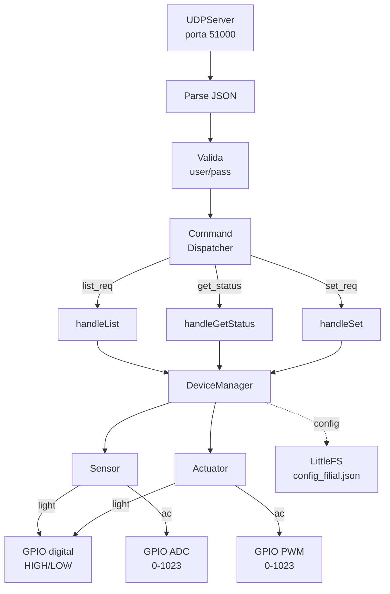
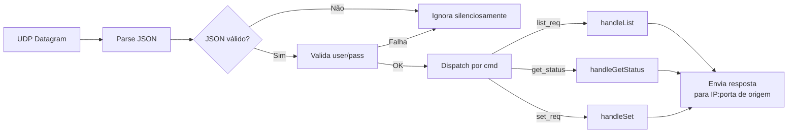

# Arquitetura da Filial

## Diagrama de Componentes

## Visão Geral

A Filial é o **servidor UDP** do sistema. Cada filial executa um ESP32 independente que:

1. **Escuta** comandos UDP na porta configurada (padrão 51000)
2. **Valida** autenticação (`user`/`pass`) em cada comando
3. **Despacha** para o handler adequado (`list_req`, `get_status`, `set_req`)
4. **Responde** para o IP:porta de origem do comando
5. **Serve** portal HTTP local na porta 80 para configuração e diagnóstico

## Tasks FreeRTOS

| Task        | Prioridade | Stack | Função                         |
| ----------- | ---------- | ----- | ------------------------------ |
| UDP Server  | Alta (2)   | 4096  | Recebe e processa comandos UDP |
| HTTP Server | Média (1)  | 4096  | Serve REST API na porta 80     |

## Fluxo de Processamento

## Módulos

| Módulo           | Biblioteca     | Descrição                           |
| ---------------- | -------------- | ----------------------------------- |
| `UDPServer`      | WiFiUDP        | Servidor UDP na porta configurada   |
| `CommandHandler` | ArduinoJson    | Parse e dispatch de comandos        |
| `DeviceManager`  | —              | Gerencia sensores e atuadores       |
| `Device`         | —              | Classe base para sensores/atuadores |
| `ConfigManager`  | LittleFS       | Persistência de configuração        |
| `WiFiManager`    | WiFi           | Conexão STA + AP                    |
| `CaptivePortal`  | AsyncWebServer | Provisionamento Wi-Fi               |

> Especificação completa da Filial: [Firmware → Filial → Overview](../firmware/filial/overview.md)
