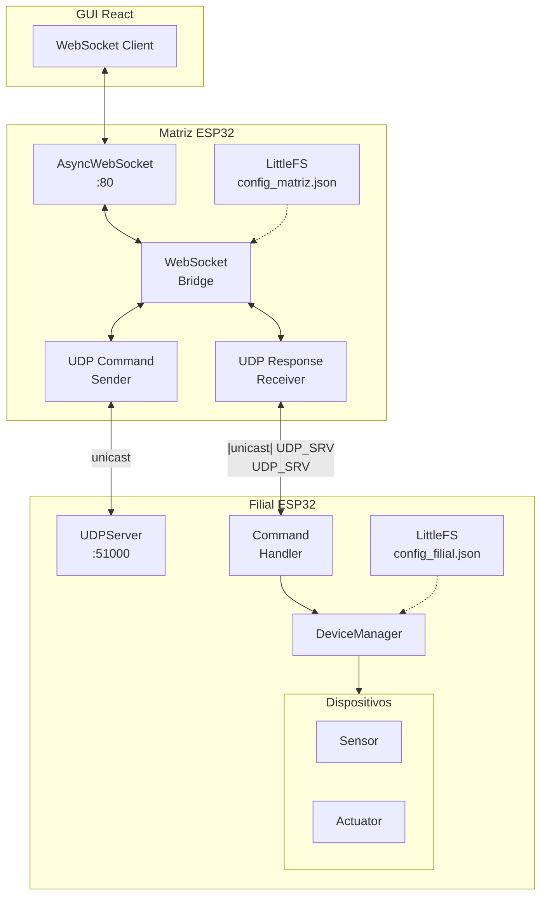
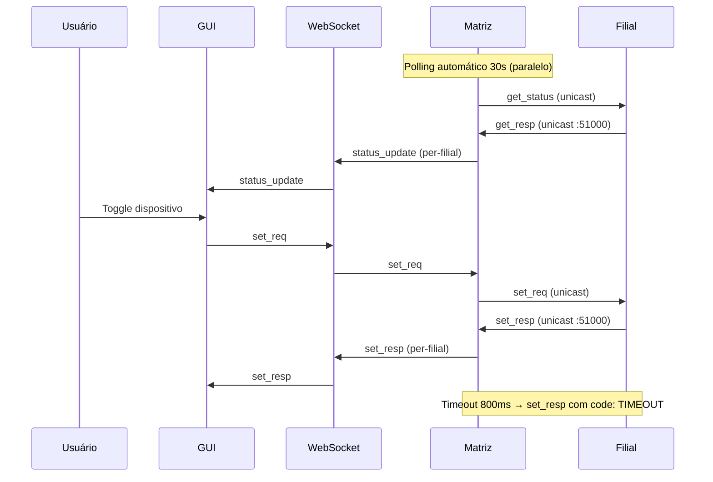

# Arquitetura do Sistema

## Visão Geral

O sistema é composto por três camadas principais: **GUI React** (navegador), **Matriz ESP32** (hub centralizador) e **Filiais ESP32** (dispositivos locais).

## Fluxo de Dados

O diagrama abaixo mostra a interação completa entre usuário, GUI, WebSocket, Matriz e Filiais:

## Entidades do Sistema

| Entidade   | Papel     | Responsabilidade                                    |
| ---------- | --------- | --------------------------------------------------- |
| **Matriz** | Cliente   | Gerencia e controla filiais, serve GUI via HTTP/WS  |
| **Filial** | Servidor  | Expõe dispositivos via UDP, serve portal local HTTP |
| **GUI**    | Dashboard | Interface React para monitoramento e controle       |

## Protocolos

| Protocolo | Uso                        | Porta | Direção             |
| --------- | -------------------------- | ----- | ------------------- |
| UDP       | Comandos e respostas IoT   | 51000 | Matriz ↔ Filial     |
| WebSocket | Atualizações em tempo real | 80    | Matriz ↔ Navegador  |
| HTTP REST | Configuração e CRUD        | 80    | Matriz/Filial ↔ Nav |

> Veja detalhes em:
> - [Arquitetura da Matriz](matriz.md)
> - [Arquitetura da Filial](filial.md)
> - [Protocolo UDP](../protocol/udp.md)
> - [Protocolo WebSocket](../protocol/websocket.md)
