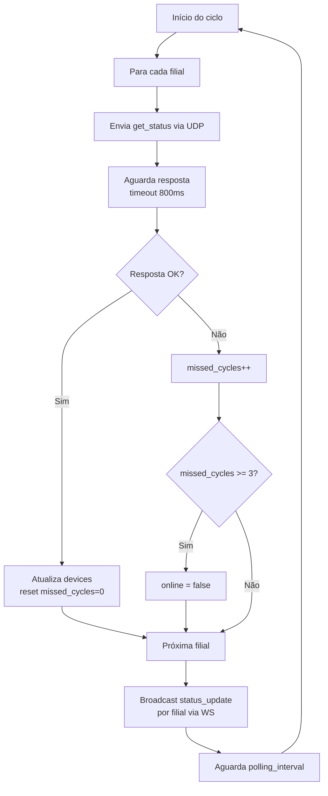
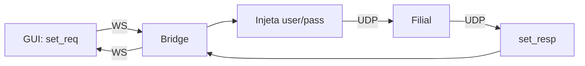

# Firmware Matriz — Overview

## Visão Geral

O firmware da Matriz roda em um ESP32 e atua como **hub centralizador** do sistema. Suas responsabilidades principais:

- Gerenciar conexão Wi-Fi (STA + AP)
- Carregar e manter configuração em LittleFS
- Descobrir dispositivos das filiais via `list_req`
- Realizar polling periódico via `get_status`
- Controlar dispositivos via `set_req`
- Fazer bridge UDP ↔ WebSocket
- Servir GUI React via HTTP
- Expor API REST para configuração

> Para endpoints REST, veja [REST API](rest-api.md).

---

## Modelo de Dados

### Estrutura de Filial (Runtime)

```cpp
struct FilialRuntime {
    String name;
    String ip;
    uint16_t port;       // padrão 51000
    bool online;
    uint8_t missed_cycles;
    std::vector<DeviceState> devices;
};
```

### Estrutura de Dispositivo (Runtime)

```cpp
struct DeviceState {
    String id;           // ex: "actuator_light_sala"
    int value;           // 0|1 (light) ou 0-1023 (ac)
};
```

---

## Configuração

### `config_matriz.json`

```json
{
    "filiais": [
        {
            "name": "Filial Centro",
            "ip": "192.168.1.101",
            "port": 51000
        }
    ],
    "polling_interval": 30000,
    "discovery_every_cycles": 10,
    "user": "admin",
    "pass": "admin"
}
```

| Campo                    | Tipo   | Padrão | Descrição                            |
| ------------------------ | ------ | ------ | ------------------------------------ |
| `filiais`                | array  | `[]`   | Lista de filiais configuradas        |
| `polling_interval`       | number | 30000  | Intervalo de polling (ms)            |
| `discovery_every_cycles` | number | 10     | Ciclos entre descobertas automáticas |
| `user`                   | string | —      | Usuário global para autenticação UDP |
| `pass`                   | string | —      | Senha global para autenticação UDP   |

### `config_wifi.json` (comum)

```json
{
    "mode": "sta",
    "ssid": "MinhaRede",
    "password": "senha123",
    "ap_ssid": "Matriz-Setup",
    "ap_password": "12345678"
}
```

> Para detalhes completos de configuração, veja [Infraestrutura → Config](../../infrastructure/config.md).

---

## Polling (Ciclo Automático)

O polling executa em loop infinito com intervalo configurável (`polling_interval`, padrão 30s).

### Fluxo do Polling



### Detecção de Offline

| Condição                 | Resultado                 |
| ------------------------ | ------------------------- |
| Resposta OK              | `online=true`, `missed=0` |
| Timeout (800ms)          | `missed_cycles++`         |
| `missed_cycles >= 3`     | `online=false`            |
| Filial volta a responder | `online=true`, `missed=0` |

---

## Descoberta de Dispositivos

Ao iniciar ou quando solicitado via GUI:

1. Envia `list_req` para cada filial configurada
2. Armazena a lista de dispositivos no runtime
3. Disponibiliza via `list_resp` no WebSocket

---

## Comportamento de Controle (`set_req`)



1. GUI envia `set_req` via WebSocket (sem `user`/`pass`)
2. Matriz injeta credenciais globais (`user`/`pass`) no comando
3. Envia UDP unicast para a filial
4. Aguarda resposta (timeout 800ms)
5. Retorna `set_resp` para a GUI via WebSocket
6. Em caso de timeout, retorna `code: TIMEOUT`

---

## Tasks FreeRTOS

| Task               | Prioridade | Stack | Descrição                   |
| ------------------ | ---------- | ----- | --------------------------- |
| UDP Command Sender | Alta       | 4096  | Envia polling e comandos    |
| UDP Response Rx    | Alta       | 4096  | Recebe e processa respostas |
| HTTP Server        | Média      | 4096  | REST API + WebSocket + GUI  |

---

## Módulos do Firmware

```
matriz-esp32/
├── lib/
│   ├── UDPClient/           # Envio de comandos UDP
│   ├── UDPResponseHandler/  # Processamento de respostas
│   ├── FilialManager/       # Gerenciamento de filiais
│   ├── WebSocketBridge/     # Bridge UDP ↔ WS
│   ├── ConfigManager/       # Persistência LittleFS
│   ├── WiFiManager/         # Conexão STA + AP
│   └── CaptivePortal/       # Provisionamento Wi-Fi
├── src/
│   └── main.cpp             # Setup + loop principal
└── data/                    # Arquivos estáticos (GUI)
```
