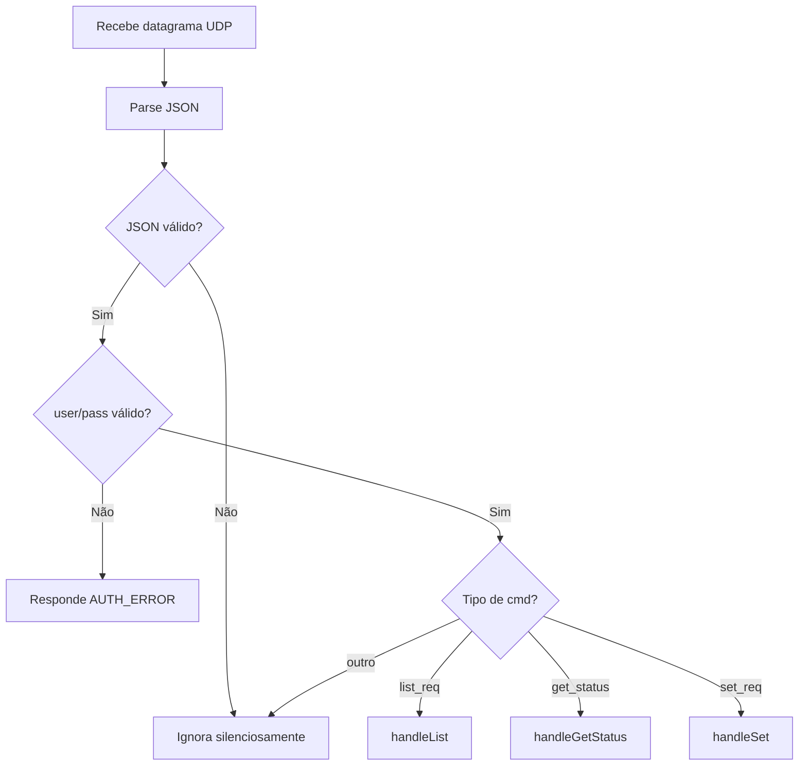

# Firmware Filial — Overview

## Visão Geral

O firmware da Filial roda em um ESP32 e atua como **servidor UDP** do sistema. Suas responsabilidades principais:

- Gerenciar conexão Wi-Fi (STA + AP)
- Carregar e manter configuração em LittleFS
- Escutar comandos UDP na porta configurada
- Gerenciar sensores e atuadores via GPIO
- Processar comandos (`list_req`, `get_status`, `set_req`)
- Responder via UDP para o IP:porta de origem
- Servir portal HTTP local para diagnóstico

> Para endpoints REST locais, veja [REST API](rest-api.md).

---

## Modelo de Dados

### Configuração (`config_filial.json`)

```json
{
    "filial_id": "FIL001",
    "label": "Filial Centro",
    "port": 51000,
    "user": "admin",
    "pass": "1234",
    "devices": [
        {
            "id": "luz_sala",
            "label": "Luz da Sala",
            "type": "light",
            "role": "sensor_actuator",
            "gpio_read": 23,
            "gpio_write": 22
        },
        {
            "id": "ar_sala",
            "label": "Ar-condicionado da Sala",
            "type": "ac",
            "role": "sensor_actuator",
            "gpio_read": 34,
            "gpio_write": 25
        }
    ]
}
```

| Campo       | Tipo   | Descrição                          |
| ----------- | ------ | ---------------------------------- |
| `filial_id` | string | Identificador único da filial      |
| `label`     | string | Nome amigável                      |
| `port`      | number | Porta UDP (padrão 51000)           |
| `user`      | string | Usuário para autenticação UDP      |
| `pass`      | string | Senha para autenticação UDP        |
| `devices`   | array  | Lista de dispositivos configurados |

### Dispositivo (Config)

| Campo        | Tipo   | Descrição                          |
| ------------ | ------ | ---------------------------------- |
| `id`         | string | Identificador único do dispositivo |
| `label`      | string | Nome amigável                      |
| `type`       | string | `"light"` ou `"ac"`                |
| `role`       | string | `"sensor_actuator"`                |
| `gpio_read`  | number | GPIO para leitura (sensor)         |
| `gpio_write` | number | GPIO para escrita (atuador)        |

---

## Hierarquia de Classes

```
Device (base)
├── Sensor        → read() via GPIO
└── Actuator      → write() via GPIO
    └── SensorActuator → herda ambos

DeviceManager
├── devices[]     → lista de Device*
├── add()         → registra dispositivo
├── getById()     → busca por ID
├── readAll()     → lê todos os sensores
├── setDevice()   → escreve em atuador
└── toJson()      → serializa estado

CommandHandler
├── handleList()       → list_req
├── handleGetStatus()  → get_status
└── handleSet()        → set_req

UDPServer
├── begin()      → inicia servidor UDP
├── loop()       → processa datagramas
└── respond()    → envia resposta para IP:porta de origem
```

---

## Mapeamento GPIO

### Luz (`type: "light"`)

| Operação | GPIO Mode | Função           | Valores    |
| -------- | --------- | ---------------- | ---------- |
| Leitura  | `INPUT`   | `digitalRead()`  | `0` ou `1` |
| Escrita  | `OUTPUT`  | `digitalWrite()` | `0` ou `1` |

### Ar-condicionado (`type: "ac"`)

| Operação | GPIO Mode | Função              | Valores  |
| -------- | --------- | ------------------- | -------- |
| Leitura  | `ANALOG`  | `analogRead()`      | `0–1023` |
| Escrita  | `OUTPUT`  | `ledcWrite()` (PWM) | `0–1023` |

---

## Processamento de Comandos

### Fluxo de Autenticação



### `handleList()`

1. Itera sobre `DeviceManager::devices[]`
2. Para cada dispositivo, extrai `id`, `label`, `type`, `role`
3. Monta resposta `list_resp` com array `devices`
4. Envia via UDP para IP:porta de origem

### `handleGetStatus()`

1. Itera sobre `DeviceManager::devices[]`
2. Para cada dispositivo, chama `read()` para obter valor atual
3. Monta resposta `get_resp` com array `devices` (inclui `value` e `status`)
4. Envia via UDP para IP:porta de origem

### `handleSet()`

1. Busca dispositivo por `device_id` via `DeviceManager::getById()`
2. Se não encontrado → responde `NOT_FOUND`
3. Chama `write(value)` no atuador
4. Lê o valor de volta para confirmar
5. Monta resposta `set_resp` com `code`, `value`
6. Envia via UDP para IP:porta de origem

---

## Tasks FreeRTOS

| Task        | Prioridade | Stack | Função                         |
| ----------- | ---------- | ----- | ------------------------------ |
| UDP Server  | Alta (2)   | 4096  | Recebe e processa comandos UDP |
| HTTP Server | Média (1)  | 4096  | Serve REST API na porta 80     |

---

## Módulos do Firmware

```
filial-esp32/
├── lib/
│   ├── UDPServer/        # Servidor UDP
│   ├── CommandHandler/   # Parse e dispatch de comandos
│   ├── DeviceManager/    # Gerenciamento de dispositivos
│   ├── Device/           # Classes base (Sensor, Actuator)
│   ├── ConfigManager/    # Persistência LittleFS
│   └── WiFiManager/      # Conexão STA + AP
├── src/
│   └── main.cpp          # Setup + loop principal
└── data/                 # Arquivos estáticos (portal)
```
