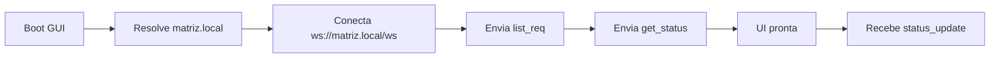

# GUI — Matriz Dashboard

## Visão Geral

A GUI é uma aplicação **React 19** servida pela Matriz ESP32 via LittleFS. Permite monitorar e controlar todas as filiais e seus dispositivos em tempo real via WebSocket.

| Tecnologia       | Versão/Ferramenta     |
| ---------------- | --------------------- |
| React            | 19                    |
| Vite             | Build tool            |
| TypeScript       | Linguagem             |
| shadcn/ui        | Componentes           |
| TailwindCSS      | Estilos               |
| lucide-react     | Ícones                |
| Native WebSocket | Comunicação real-time |

---

## Arquitetura

```
matriz-gui/src/
├── main.tsx          # Entry point
├── App.tsx           # Root component + WebSocket
├── App.css           # Estilos globais
├── index.css         # Tailwind directives
└── assets/           # Ícones e imagens
```

---

## Conexão WebSocket

### Descoberta via mDNS

A GUI descobre a Matriz automaticamente via **mDNS**:

| Serviço mDNS  | Valor                  |
| ------------- | ---------------------- |
| Hostname      | `matriz.local`         |
| Porta         | `80`                   |
| WebSocket URL | `ws://matriz.local/ws` |

### Fluxo de Conexão



### Reconexão Automática

| Condição               | Ação                               |
| ---------------------- | ---------------------------------- |
| Conexão perdida        | Tentar reconectar a cada 5s        |
| Reconexão bem-sucedida | Reenviar `list_req` + `get_status` |

---

## Visualização de Dispositivos

### Grid de Filiais

Cada filial é exibida como um **card** contendo:

| Elemento       | Descrição                           |
| -------------- | ----------------------------------- |
| Nome da filial | `name` da configuração              |
| Status online  | Indicador visual (verde/vermelho)   |
| IP             | Endereço IP da filial               |
| Dispositivos   | Lista de dispositivos com controles |

### Dispositivo — Luz (`type: "light"`)

| Controle  | Tipo       | Valores         |
| --------- | ---------- | --------------- |
| Toggle    | Switch     | ON / OFF        |
| Indicador | LED visual | Aceso / Apagado |

### Dispositivo — Ar-condicionado (`type: "ac"`)

| Controle    | Tipo         | Valores      |
| ----------- | ------------ | ------------ |
| Intensidade | Slider       | 0–1023       |
| Indicador   | Barra visual | Proporcional |

---

## Enviar Comandos

### Fluxo de Toggle (Luz)

1. Usuário clica no switch do dispositivo
2. GUI envia `set_req` via WebSocket:

```json
{
    "cmd": "set_req",
    "filial_ip": "10.0.0.1",
    "filial_port": 51000,
    "id": "actuator_light_sala",
    "value": 1
}
```

3. Aguarda `set_resp` via WebSocket
4. Atualiza UI otimisticamente ou reverte em caso de erro

### Indicadores de Estado

| Estado             | Visual                        |
| ------------------ | ----------------------------- |
| Comando enviado    | Spinner / loading no controle |
| Sucesso (`OK`)     | Valor atualizado              |
| Erro (`TIMEOUT`)   | Toast de erro + reverte valor |
| Erro (`NOT_FOUND`) | Toast de erro                 |

---

## Histórico de Comandos

A GUI mantém um **histórico local** dos últimos comandos enviados.

| Campo         | Tipo     | Descrição                |
| ------------- | -------- | ------------------------ |
| `timestamp`   | ISO 8601 | Momento do comando       |
| `filial_ip`   | string   | IP da filial alvo        |
| `filial_port` | number   | Porta da filial alvo     |
| `id`          | string   | Dispositivo alvo         |
| `value`       | number   | Valor enviado            |
| `result`      | string   | `OK`, `TIMEOUT`, `ERROR` |

---

## Tela de Configurações

Acessível via menu de configurações, permite:

| Funcionalidade    | Endpoint REST             |
| ----------------- | ------------------------- |
| Adicionar filial  | `POST /api/filiais`       |
| Editar filial     | `PUT /api/filiais/:id`    |
| Remover filial    | `DELETE /api/filiais/:id` |
| Alterar Wi-Fi     | `POST /api/wifi`          |
| Forçar descoberta | `POST /api/discover`      |

---

## Build e Deploy

A GUI é compilada com Vite e os artefatos são copiados para `matriz-esp32/data/` para upload ao LittleFS.

```bash
# Build
cd matriz-gui && pnpm build

# Copiar para ESP32
cp -r dist/* ../matriz-esp32/data/

# Upload via PlatformIO
cd ../matriz-esp32 && pio run -t uploadfs
```

> Para detalhes completos de build, veja [DevOps → Build & Deploy](../../devops/build-deploy.md).
