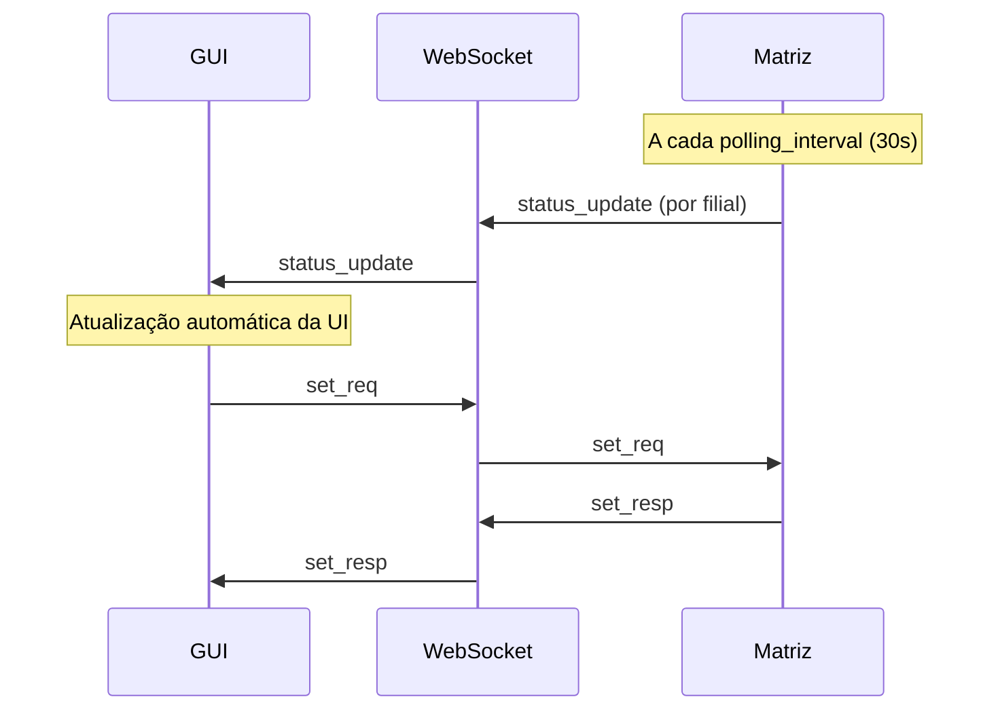

# Protocolo WebSocket

## Visão Geral

A GUI React se comunica com a Matriz ESP32 via **WebSocket** na porta **80**. O path padrão é `/ws`.

| Aspecto    | Valor                  |
| ---------- | ---------------------- |
| Protocolo  | WebSocket              |
| Porta      | 80                     |
| Path       | `/ws`                  |
| Encoding   | JSON UTF-8             |
| Biblioteca | AsyncWebSocket (ESP32) |
| Client     | Native WebSocket API   |

---

## Mensagens GUI → Matriz

### `list_req` — Solicitar Dispositivos

```json
{ "cmd": "list_req" }
```

### `get_status` — Solicitar Estado Atual

```json
{ "cmd": "get_status" }
```

### `set_req` — Enviar Comando

```json
{
  "cmd": "set_req",
  "filial_id": "FIL001",
  "device_id": "luz_sala",
  "value": 1
}
```

> **Nota**: A GUI **não** envia `user`/`pass`. A Matriz injeta as credenciais antes de encaminhar via UDP.

---

## Mensagens Matriz → GUI

### `list_resp` — Lista de Dispositivos

```json
{
  "cmd": "list_resp",
  "filiais": [
    {
      "filial_id": "FIL001",
      "label": "Filial Centro",
      "ip": "192.168.1.101",
      "online": true,
      "devices": [
        {
          "id": "luz_sala",
          "label": "Luz da Sala",
          "type": "light",
          "role": "sensor_actuator"
        }
      ]
    }
  ]
}
```

### `status_update` — Atualização de Estado (Broadcast)

Enviado automaticamente após cada ciclo de polling (por filial).

```json
{
  "cmd": "status_update",
  "filial_id": "FIL001",
  "online": true,
  "devices": [
    {
      "id": "luz_sala",
      "label": "Luz da Sala",
      "type": "light",
      "role": "sensor_actuator",
      "value": 1,
      "status": "ok"
    }
  ]
}
```

### `set_resp` — Resposta de Comando

```json
{
  "cmd": "set_resp",
  "filial_id": "FIL001",
  "device_id": "luz_sala",
  "code": "OK",
  "value": 1
}
```

---

## Ciclo de Atualização



## Bridge WebSocket

A Matriz atua como **bridge** entre o protocolo UDP (filiais) e WebSocket (GUI):

| Direção               | Ação                                            |
| --------------------- | ----------------------------------------------- |
| GUI → WS → Matriz     | Recebe comando, injeta `user`/`pass`, envia UDP |
| Filial → UDP → Matriz | Recebe resposta, envia via WS para GUI          |
| Polling → Matriz      | Envia `status_update` para todos os clients WS  |
