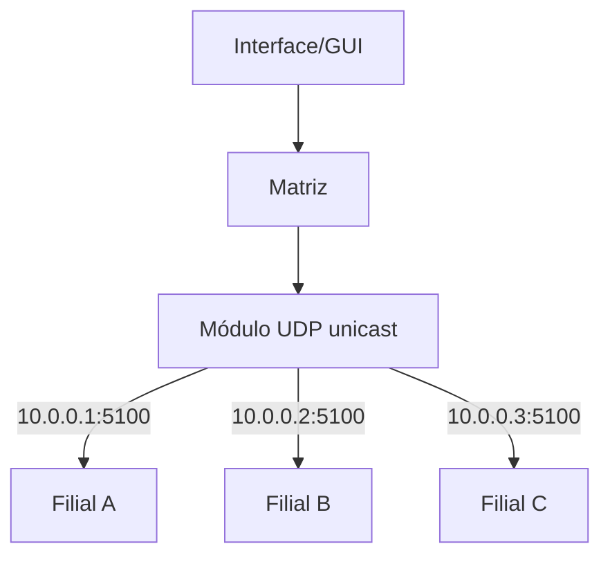
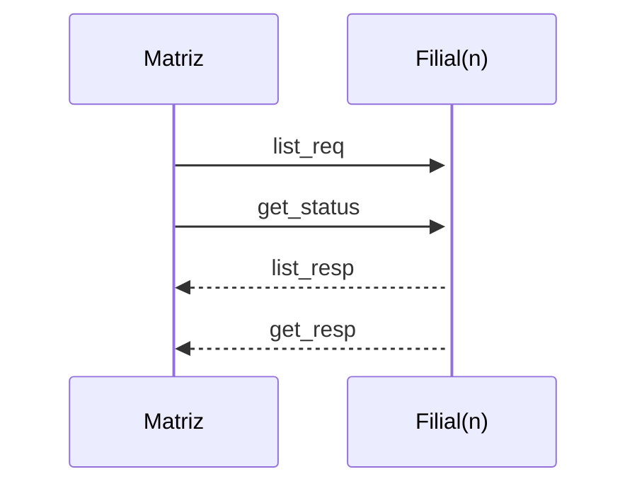

# Requisitos Detalhados — UDP Sistema de Monitoramento

> Sistema IoT onde uma **Matriz** monitora e controla luzes e ar-condicionado de múltiplas **Filiais** via UDP unicast. A GUI web permite visualizar estado, ligar/desligar dispositivos e gerenciar filiais.

---

## 1. Visão Geral

### 1.1 Problema

> "Temos diversas filiais com gasto excessivo de energia por luzes e ares-condicionados que ficam ligados fora do horário de trabalho. Queremos monitorar e controlar tudo remotamente."

### 1.2 Solução

Matriz central envia comandos **UDP unicast** para filiais, que respondem com o estado dos dispositivos. Uma **GUI** que permite ao operador visualizar e controlar tudo em tempo real.

---

## 2. Arquitetura

### 2.1 Entidades

| Entidade   | Papel    | Responsabilidade                     |
| ---------- | -------- | ------------------------------------ |
| **Matriz** | Cliente  | Gerencia e controla todas as filiais |
| **Filial** | Servidor | Expõe sensores e atuadores via UDP   |

### 2.2 Protocolo

| Parâmetro       | Valor                 | Notas                                                   |
| --------------- | --------------------- | ------------------------------------------------------- |
| Transporte      | UDP (unicast)         | Sem retransmissão — o próximo polling recupera o estado |
| Formato         | JSON (UTF-8)          | Toda comunicação                                        |
| Autenticação    | `user` + `pass`       | Em **toda** requisição; texto puro (rede local)         |
| Porta padrão    | 51000                 | Porta UDP da filial                                     |
| Polling padrão  | 15 s                  | Configurável pelo usuário na GUI                        |
| Timeout offline | 3 ciclos sem resposta | Filial marcada offline automaticamente                  |

### 2.3 Fluxo de Comunicação

#### 2.3.1 Polling automático (monitoramento)

Clicando em **"Conectar"**, a Matriz inicia o ciclo:

```
Matriz --[list_req + get_status]--> Filial A (unicast)
Matriz --[list_req + get_status]--> Filial B (unicast)
Filiais --> Matriz (respostas unicast)
Matriz --> GUI (atualização em tempo real)
```

- O ciclo se repete continuamente conforme `polling_interval`
- **"Desconectar"** para o polling — nenhuma requisição é enviada fora desse ciclo

#### 2.3.2 Controle manual (atuadores)

```
Usuário clica na GUI --> set_req --> Matriz --> Filial (UDP)
Filial aplica alteração --> set_resp --> Matriz --> GUI (confirmação)
```

> Após `set_req`, o estado é atualizado apenas após a resposta da filial (consistência).

#### 2.3.3 Configuração de filiais e polling

1. Matriz carrega `config_matriz.json` (lista de filiais + `polling_interval`)
2. GUI exibe e permite **adicionar / editar / remover** filiais
3. Campo **"Intervalo de Polling"** (segundos) — alteração aplicada imediatamente, sem reconectar
4. Todas as alterações são salvas em `config_matriz.json`

### 2.4 Notas Arquiteturais

- **Autenticação**: credenciais `user`/`pass` em **cada requisição** JSON, texto puro (aceitável em rede local)
- **Erros**: requisições inválidas são **ignoradas silenciosamente** pela filial — sem resposta, sem erro
- **Unicast**: Matriz → Filial individualmente via IP:porta do `config_matriz.json`
- **Identificação**: conflito de IDs entre filiais resolvido por IP:porta de origem
- **Validação**: Matriz normaliza/valida respostas antes de encaminhar à GUI
- **Conexão**: polling só inicia após clicar **"Conectar"**; desconectado = silêncio total

---

## 3. Comandos

### 3.1 Comandos disponíveis

Todos os comandos incluem `user` e `pass`. Requisições inválidas são **ignoradas silenciosamente** pela filial (sem resposta, sem erro).

| Comando      | Descrição                     | Campos extras  |
| ------------ | ----------------------------- | -------------- |
| `list_req`   | Lista todos os dispositivos   | —              |
| `get_status` | Estado atual dos dispositivos | —              |
| `set_req`    | Altera valor de um device     | `id` + `value` |

### 3.2 `list_req` — Listar dispositivos

**Requisição:**

```json
{
  "cmd": "list_req",
  "user": "admin",
  "pass": "admin"
}
```

**Resposta:**

```json
{
  "cmd": "list_resp",
  "id": ["actuator_light_sala", "sensor_light_sala", "actuator_ac_escritorio"]
}
```

> A ordem dos IDs **não é garantida** — não assuma nenhuma ordenação.

### 3.3 `get_status` — Estado atual

**Requisição:**

```json
{
  "cmd": "get_status",
  "user": "admin",
  "pass": "admin"
}
```

**Resposta:**

```json
{
  "cmd": "get_resp",
  "actuator_light_sala": true,
  "sensor_light_sala": false,
  "actuator_ac_escritorio": 720
}
```

### 3.4 `set_req` — Alterar estado

**Luz (boolean):**

```json
{
  "cmd": "set_req",
  "user": "admin",
  "pass": "admin",
  "id": "actuator_light_sala",
  "value": true
}
```

**Ar-condicionado (analógico 0–1023):**

```json
{
  "cmd": "set_req",
  "user": "admin",
  "pass": "admin",
  "id": "actuator_ac_escritorio",
  "value": 500
}
```

**Resposta:**

```json
{
  "cmd": "set_resp",
  "id": "actuator_light_sala",
  "value": true
}
```

### 3.5 Tratamento de erros pela filial

A filial **ignora silenciosamente** (sem resposta) quando:

- `user` / `pass` inválidos
- `cmd` desconhecido
- JSON malformado ou campos obrigatórios faltando
- `id` inexistente ou aponta para `sensor_*` em `set_req`
- `value` fora do range esperado

> **Princípio**: cada pacote é processado de forma **atômica e independente** — sem concorrência entre requisições.

---

## 4. Dispositivos

### 4.1 Formato do ID

```
<type>_<dispositivo>_<local>
```

| Parte           | Valores               | Exemplo              |
| --------------- | --------------------- | -------------------- |
| `<type>`        | `sensor` / `actuator` | `actuator`           |
| `<dispositivo>` | `light` / `ac`        | `light`              |
| `<local>`       | string livre          | `sala`, `escritorio` |

**Exemplos**: `actuator_light_sala`, `sensor_ac_escritorio`, `actuator_light_reuniao`

### 4.2 Tipos de dispositivos

| Tipo         | Descrição                                |
| ------------ | ---------------------------------------- |
| `sensor_*`   | Dispositivo de entrada (somente leitura) |
| `actuator_*` | Dispositivo de saída (leitura + escrita) |

**Exemplos**: `sensor_light_sala`, `actuator_light_sala`, `sensor_ac_escritorio`, `actuator_ac_escritorio`

### 4.3 Restrições de acesso e valores

| Tipo         | Acesso            | `light` | `ac`   |
| ------------ | ----------------- | ------- | ------ |
| `sensor_*`   | Somente leitura   | bool    | 0–1023 |
| `actuator_*` | Leitura + escrita | bool    | 0–1023 |

> Tentativa de `set_req` em `sensor_*` → silenciosamente ignorada.

---

## 5. Identificação de Filiais

Cada filial é identificada por **IP:porta** de origem UDP. Isso permite IDs duplicados entre filiais sem conflito — a Matriz distingue pelo endereço de origem.

---

## 6. Comportamento de Conexão

### 6.1 Ciclo de polling e timeout

A cada ciclo, a Matriz envia `list_req` + `get_status` e conta falhas consecutivas:

| Ciclos sem resposta | Estado da filial |
| ------------------- | ---------------- |
| 0                   | **Online**       |
| 1                   | Online           |
| 2                   | Online           |
| 3                   | **Offline**      |

- Filial offline **permanece na lista** com status offline
- Quando responde novamente → volta a **online**
- `offline_threshold` = `polling_interval` × 3

### 6.2 Estado de carregamento

Antes da primeira resposta de uma filial, a GUI exibe **carregando** para seus dispositivos.

---

## 7. Requisitos Funcionais

### 7.1 Monitoramento

- Lista de filiais com status **online / offline / carregando**
- Estado em tempo real de todos os dispositivos por filial
- Polling automático com intervalo **configurável** (padrão: 15 s)
- Atualização contínua enquanto conectado

### 7.2 Controle

- Alterar estado de atuadores (luz liga/desliga, AC intensidade 0–1023)
- Feedback visual imediato após confirmação da filial

### 7.3 Configuração

- Gerenciar filiais: **adicionar / editar / remover** (nome, IP, porta)
- Alterar intervalo de polling (aplicado imediatamente)
- **Conectar / Desconectar** polling
- Tudo salvo em `config_matriz.json`

---

## 8. Arquivos de Configuração

### 8.1 `config_filial.json` (em cada filial)

```json
{
  "port": 51000,
  "admin_user": "test",
  "admin_pass": "test",
  "id": [
    "actuator_light_sala",
    "sensor_light_sala",
    "actuator_ac_escritorio",
    "sensor_ac_escritorio"
  ]
}
```

| Campo        | Tipo   | Descrição                                    |
| ------------ | ------ | -------------------------------------------- |
| `port`       | int    | Porta UDP que a filial escuta (padrão 51000) |
| `admin_user` | string | Usuário para autenticar a matriz             |
| `admin_pass` | string | Senha para autenticar a matriz               |
| `id`         | array  | Lista de IDs de sensores e atuadores         |

### 8.2 `config_matriz.json` (na matriz)

```json
{
  "user": "admin",
  "pass": "admin",
  "polling_interval": 15,
  "filiais": [
    { "name": "Filial Centro", "ip": "192.168.1.100", "port": 51000 },
    { "name": "Filial Norte",  "ip": "192.168.1.101", "port": 51000 }
  ]
}
```

| Campo              | Tipo   | Descrição                                 |
| ------------------ | ------ | ----------------------------------------- |
| `user`             | string | Credencial para autenticar com as filiais |
| `pass`             | string | Senha para autenticar com as filiais      |
| `polling_interval` | int    | Segundos entre cada polling (padrão: 15)  |
| `filiais`          | array  | Lista com `name`, `ip`, `port`            |

---

## 9. Arquitetura Visual



## 9.1 Diagrama de Sequência




---

## 10. Ambiente de Teste

- Mínimo **2 filiais** executando o firmware
- **1 matriz** executando software + GUI
- Cada filial com `config_filial.json` próprio
- Matriz conecta em todas simultaneamente
