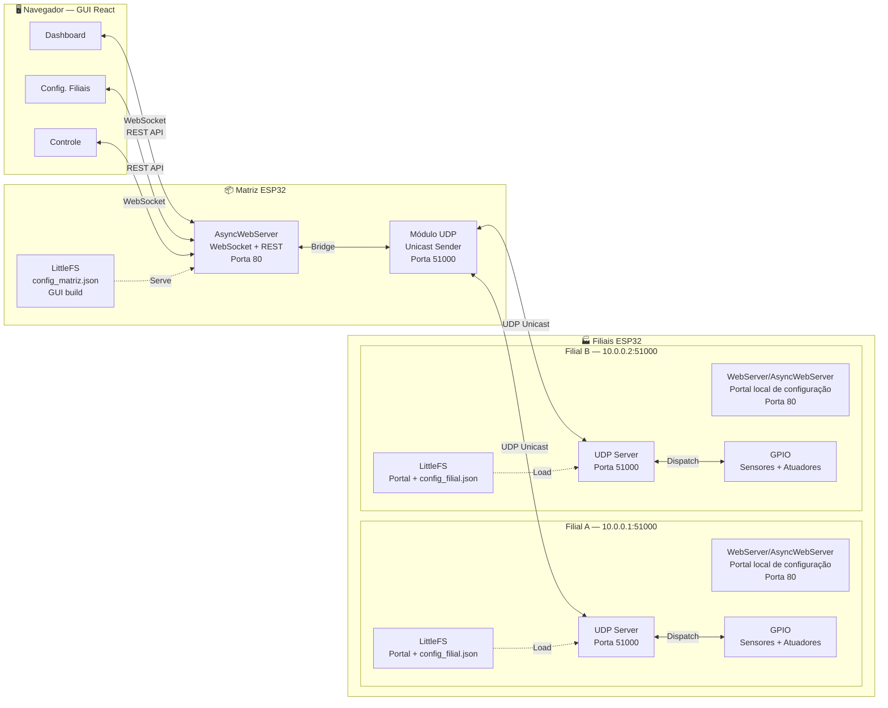
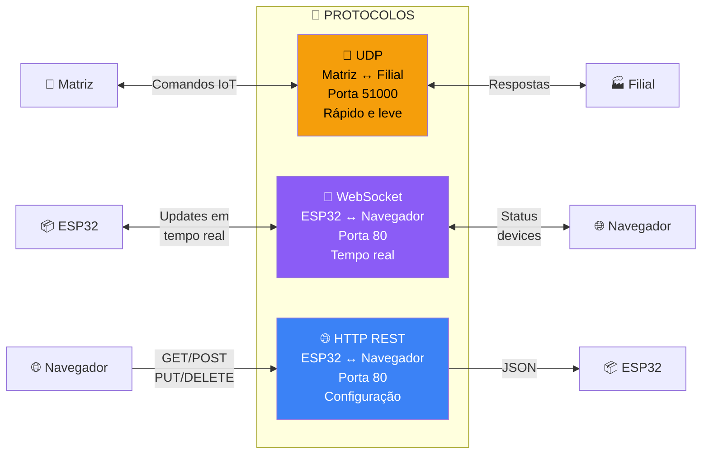
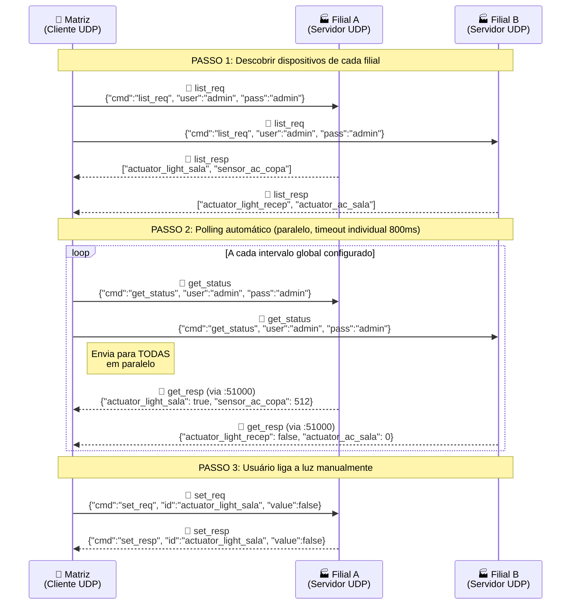
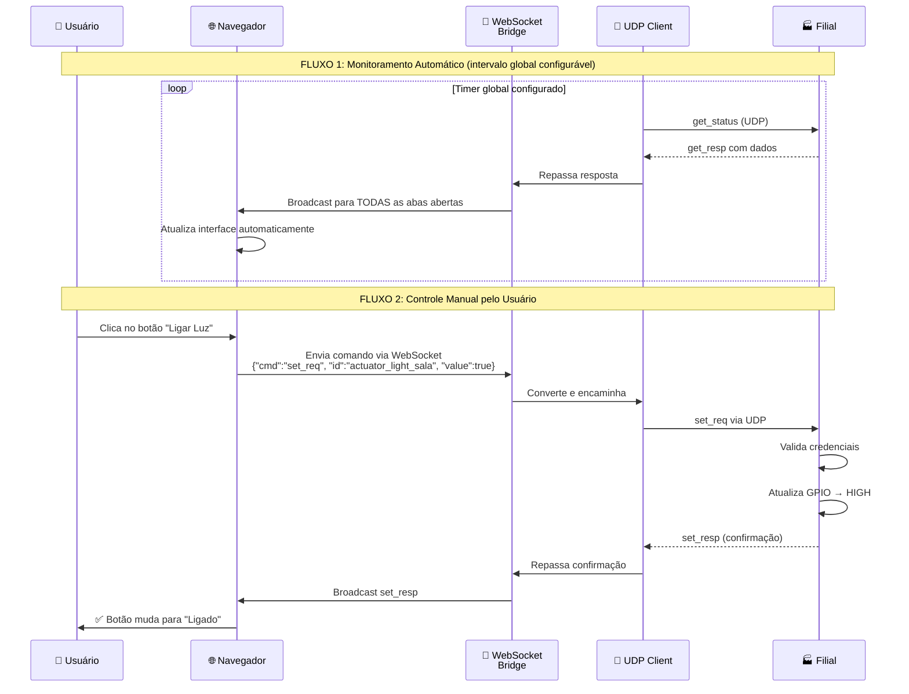

<!-- markdownlint-disable-file MD013 MD022 MD026 MD031 MD032 MD036 MD040 MD012 -->

# UDP IoT Monitoramento

## 1. Introdução

### 1.1 Contexto

Ema empresa com várias filiais espalhadas pela cidade está gastando muito dinheiro sendo desperdiçado com energia elétrica.

> Luzes ficam ligadas durante a noite (quando não tem ninguém trabalhando)
> Ar-condicionados continuam funcionando nos finais de semana
> Ninguém na matriz sabe o que está acontecendo em cada filial em tempo real
> Cada filial funciona de forma independente, sem controle centralizado

**Solução:** Um sistema IoT que permite monitorar e controlar tudo remotamente, direto de um computador na matriz.

### 1.2 Visão Geral

**1.2.1 Matriz**

- Um ESP32 rodando na matriz da empresa
- Serve um site (dashboard) para os Usuários
- Manda comandos para todas as filiais via WiFi
- Recebe os dados de todas as filiais em tempo real

**1.2.2 Filiais**
- Cada filial tem seu próprio ESP32
- Conectado a sensores (para ver o que está acontecendo)
- Conectado a atuadores (para ligar/desligar equipamentos)
- Recebe comandos da matriz e executa ações
- Também expõe um portal local de configuração e diagnóstico
- Esse portal é acessado apenas na rede da própria filial e não substitui o dashboard central

**1.2.3 Portal Local da Filial**
- Interface local simples, servida pelo ESP32 da filial
- Usada para configurar Wi-Fi, credenciais, IP e parâmetros básicos de operação
- Exibe o status dos sensores e atuadores daquela filial
- Serve para manutenção e testes locais, não para operação centralizada
- É carregada do LittleFS da filial e atendida via HTTP/REST na porta 80

**1.2.4 Interface Web**
- Um site moderno feito em React
- Mostra o status de todas as filiais em tempo real
- Permite ligar/desligar luzes e ar-condicionado com um clique
- Atualiza automaticamente sem precisar dar refresh
- A GUI final é servida pela Matriz via LittleFS

## 2. Estrutura

### 2.1 Entidades do Sistema

#### 2.1.1 Matriz

- Gerencia todas as filiais remotamente
- Serve o dashboard web para os Usuários
- Envia comandos via rede WiFi
- Recebe atualizações em tempo real

**Tecnologias:**

- Hardware: ESP32 (microcontrolador com WiFi)
- Software: AsyncWebServer (servidor web) + WebSocket (comunicação em tempo real)
- Função na rede: Cliente UDP (quem **faz** os pedidos)

#### 2.1.2 Filial

- Controla luzes e ar-condicionado localmente
- Lê sensores para saber o status atual
- Responde aos comandos da matriz
- Serve um portal local para configuração e diagnóstico

**Tecnologias:**
- Hardware: ESP32 com GPIOs conectados a sensores e atuadores
- Software: WiFiUDP (comunicação) + WebServer/AsyncWebServer + LittleFS
- Função na rede: Servidor UDP (quem **responde** aos pedidos) e servidor HTTP local da própria filial

#### 2.1.3 Dashboard Web

- Mostra todas as filiais em cards visuais
- Permite ligar/desligar dispositivos com um clique
- Atualiza status em tempo real (sem refresh)
- Permite adicionar/editar filiais

**Tecnologias:**
- React 19 (framework moderno)
- Vite (build rápido)
- shadcn/ui (componentes bonitos)
- WebSocket (para atualizações instantâneas)

### 2.2 Fluxo de Comunicação



> Cada filial é independente — gerencia seus próprios dispositivos e não
> depende das demais. A Matriz atua como _hub_ centralizador, mas cada
> filial também pode servir sua GUI local para configuração e diagnóstico
> sem interferir no dashboard central.

### 2.3 Protocolos de Comunicação

#### 2.3.1 UDP (Matriz ↔ Filial)

- **Muito rápido** não perde tempo criando conexão
- **Fire-and-forget** envia e esquece (sem garantia de entrega)
- **Unicast** envia para um endereço específico
- **Porta:** 51000
- **Formato:** JSON (texto puro)
- **Segurança:** `user` e `pass` em cada mensagem
- **Confiabilidade:** fire-and-forget, sem ACK obrigatório


#### 2.3.2 WebSocket (ESP32 ↔ Navegador)

- **Bidirecional** navegador E servidor podem enviar mensagens
- **Tempo real** atualiza instantaneamente
- **Porta:** 80 (mesma do HTTP)
- **Formato:** JSON
- **Reconexão automática** se cair, tenta reconectar sozinho
- **Uso principal:** atualização de estado e controle em tempo real da GUI da Matriz

#### 2.3.3 HTTP REST (ESP32 ↔ Navegador)

- **Request-Response** pergunta e resposta
- **CRUD** Create, Read, Update, Delete
- **Porta:** 80
- **Formato:** JSON
- **Sem autenticação** rede local confiável
- **Uso principal:** Portal Local da Filial para configuração e diagnóstico

**Quando usar cada um:**
- GET = Ler configuração
- POST = Criar nova filial
- PUT = Atualizar configuração
- DELETE = Remover filial

### 2.4 Visão Geral dos Protocolos



### 2.5 Fluxo de Comunicação UDP

Comunicação entre Matriz e Filial:

1. **Descoberta:** Recebe a lista de dispositivos das filiais"
2. **Monitoramento:** A cada intervalo global configurado a Matriz atualiza o status de todos os dispositivos
3. **Controle:** Quando Usuário clica, matriz envia comando "altere para X"


### 2.6 WebSocket

- **Reconexão automática:** Se WebSocket cair, tenta reconectar sozinho
- **Broadcast per-filial:** Cada atualização de filial é enviada individualmente para TODAS as abas abertas (incluindo offline com último estado conhecido)
- **Exponential backoff:** 1s → 2s → 4s → 8s → até 30s entre tentativas



### 2.7 Exemplo Prático: Ligando uma Luz

```mermaid
graph TD
    A["👤 1. Usuário clica<br/>'Ligar Luz Sala Filial A'"] --> B["🌐 2. React captura evento<br/>onClick"]
    B --> C["📤 3. Navegador envia via WebSocket<br/>{cmd:'set_req', id:'actuator_light_sala', value:true}"]
    C --> D["🔌 4. ESP32 Matriz recebe no WebSocket"]
    D --> E["🔀 5. Bridge converte para UDP"]
    E --> F["📡 6. Envia UDP para Filial A<br/>IP: 10.0.0.1:51000"]
    F --> G{"🔐 7. Filial valida<br/>user e pass"}
    G -->|❌ Inválido| H["🚫 Ignora comando<br/>sem resposta"]
    G -->|✅ Válido| I["⚡ 8. Atualiza GPIO<br/>digitalWrite(pin, HIGH)"]
    I --> J["📡 9. Filial envia resposta UDP<br/>{cmd:'set_resp', id:'...', value:true}"]
    J --> K["🔌 10. Matriz recebe UDP"]
    K --> L["📤 11. Bridge envia via WebSocket"]
    L --> M["🌐 12. Navegador recebe confirmação"]
    M --> N["✅ 13. Interface atualiza<br/>Botão mostra 'Ligado'"]

    style A fill:#3b82f6,color:#fff
