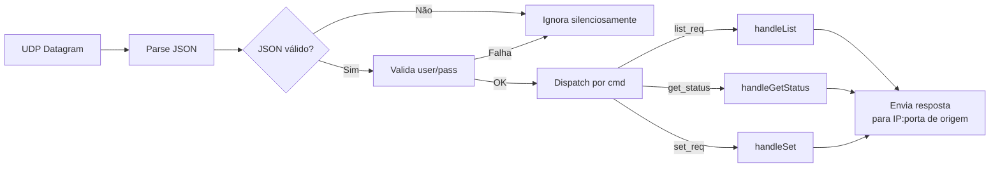

<!-- markdownlint-disable-file MD013 MD022 MD031 MD032 MD047 -->

## 1. Visão geral

**Objetivo:** Especificação executável para Filial ESP32 — servidor UDP, controle de dispositivos e portal local de configuração.

**Escopo:**
- Responder comandos UDP da Matriz (list_req, get_status, set_req)
- Servir portal local de configuração e diagnóstico via HTTP porta 80
- Persistir configuração no LittleFS
- Gerenciar sensores e atuadores via GPIO

### 1.3 Estrutura do projeto

```text
filial-esp32/
├── platformio.ini
├── data/
│   ├── config_filial.json         # Criado no primeiro salvamento
│   └── config_wifi.json           # Persistido após provisionamento
├── include/
│   └── README
├── src/
│   └── main.cpp                   # Template boilerplate
├── lib/
│   ├── ConfigManager/
│   ├── DeviceManager/
│   ├── Device/
│   ├── CommandHandler/
│   ├── UDPServer/
│   ├── WiFiManager/
│   └── CaptivePortal/
└── test/
    └── README
```

## 2. Modelo de dados

### 2.1 Estruturas de dados

```cpp
struct DeviceConfig {
    String id;          // formato: <tipo>_<dispositivo>_<local>
    uint8_t pin;
    String type;        // "sensor" ou "actuator"
    String deviceType;  // "light" ou "ac"
};
```

### 2.2 Configuração persistida (`config_filial.json`)

```json
{
  "port": 51000,
  "admin_user": "admin",
  "admin_pass": "admin",
  "devices": [
    { "id": "actuator_light_sala", "pin": 2 },
    { "id": "sensor_light_sala", "pin": 4 },
    { "id": "actuator_ac_escritorio", "pin": 16 },
    { "id": "sensor_ac_escritorio", "pin": 17 }
  ]
}
```

**Validações obrigatórias ao carregar:**
- `port`: inteiro `1–65535`
- `admin_user` e `admin_pass`: string não vazia, máximo 32 caracteres cada (usadas para validar `user`/`pass` recebidos via UDP)
- `devices`: array de objetos com `id` (não vazio, máximo 64 caracteres) e `pin` (GPIO válido)
- `devices`: campo `id` deve ser único no array
- **GPIO inválido** (ex: GPIO 6-11): dispositivo ignorado, log de warning, boot continua

### 2.3 Fallback de configuração

Quando `config_filial.json` não existir ou estiver inválido:
1. `port=51000`, `admin_user="admin"`, `admin_pass="admin"`
2. `devices` como array vazio
3. Expor API REST para provisioning
4. Persistir após primeiro `PUT /api/config` válido

## 3. Runtime e rede

**Modo de rede:** `STA` (conecta à rede) + `AP` (interface local). HTTP ativo mesmo sem STA.

### 3.1 Endereços e portas

| Interface  | Porta | Função                    |
| ---------- | ----- | ------------------------- |
| UDP Server | 51000 | Recebe comandos da Matriz |
| HTTP       | 80    | Portal local + REST API   |

### 3.2 Fallback WiFi e Modo AP

Quando `config_wifi.json` não existir ou estiver inválido:
1. Ativa **AP** com SSID `ESP32-FILIAL` + **Captive Portal** na porta 80
2. Serve formulário HTML de provisionamento Wi-Fi
3. Após `PUT /api/wifi` válido, persiste `config_wifi.json` e reinicia
4. Boot seguinte: se `config_wifi.json` válido → modo **STA+AP**

### 3.3 Tasks FreeRTOS

| Task        | Prioridade | Stack | Função                         |
| ----------- | ---------- | ----- | ------------------------------ |
| UDP Server  | Alta (2)   | 4096  | Recebe e processa comandos UDP |
| HTTP Server | Média (1)  | 4096  | Serve REST API na porta 80     |

## 4. Protocolo UDP

### 4.1 Envelope obrigatório

Todos os comandos recebidos pela Filial devem conter:

```json
{
  "cmd": "<comando>",
  "user": "<usuario>",
  "pass": "<senha>"
}
```

### 4.2 Autenticação

- Todo comando UDP deve incluir `user` e `pass`
- Credenciais são validadas contra `admin_user` e `admin_pass` em `config_filial.json`
- Falha de autenticação → resposta ignorada (por segurança)
- Timeout de autenticação: nenhum (validação síncrona no parse)

### 4.3 Tabela de comandos

| Comando      | Direção | Campos obrigatórios      | Resposta esperada |
| ------------ | ------- | ------------------------ | ----------------- |
| `list_req`   | M→F     | `cmd,user,pass`          | `list_resp`       |
| `get_status` | M→F     | `cmd,user,pass`          | `get_resp`        |
| `set_req`    | M→F     | `cmd,id,value,user,pass` | `set_resp`        |
| `list_resp`  | F→M     | `cmd,id`                 | -                 |
| `get_resp`   | F→M     | `cmd,<campos dinâmicos>` | -                 |
| `set_resp`   | F→M     | `cmd,id,value`           | -                 |

### 4.4 Payloads de referência

**`list_req`** (recebido da Matriz):

```json
{
  "cmd": "list_req",
  "user": "admin",
  "pass": "admin"
}
```

**`list_resp`** (enviado para a Matriz):

```json
{
  "cmd": "list_resp",
  "id": [
    "actuator_light_sala",
    "sensor_light_sala",
    "actuator_ac_escritorio",
    "sensor_ac_escritorio"
  ]
}
```

**`get_status`** (recebido da Matriz):

```json
{
  "cmd": "get_status",
  "user": "admin",
  "pass": "admin"
}
```

**`get_resp`** (enviado para a Matriz):

```json
{
  "cmd": "get_resp",
  "actuator_light_sala": true,
  "sensor_light_sala": false,
  "actuator_ac_escritorio": 72,
  "sensor_ac_escritorio": 45
}
```

**`set_req`** (recebido da Matriz):

```json
{
  "cmd": "set_req",
  "id": "actuator_light_sala",
  "value": true,
  "user": "admin",
  "pass": "admin"
}
```

**`set_resp`** (enviado para a Matriz):

```json
{
  "cmd": "set_resp",
  "id": "actuator_light_sala",
  "value": true
}
```

### 4.5 Envio de respostas

- Todas as respostas UDP são enviadas de volta para o **IP e porta de origem** do comando recebido
- A Matriz escuta respostas na porta **51000** (fixa)
- UDP malformado (JSON inválido) é **ignorado silenciosamente (por segurança)**
- A Filial deve estar preparada para receber múltiplos comandos em sequência rápida (polling paralelo da Matriz)
- **Múltiplos `set_req` simultâneos** para o mesmo dispositivo: último comando recebido prevalece (processamento FIFO síncrono no loop UDP)

## 5. Dispositivos

### 5.1 Formato do ID

```text
<tipo>_<dispositivo>_<local>
```

| Parte         | Valores               | Exemplo              |
| ------------- | --------------------- | -------------------- |
| `tipo`        | `sensor` / `actuator` | `actuator`           |
| `dispositivo` | `light` / `ac`        | `light`              |
| `local`       | string livre          | `sala`, `escritorio` |

**Exemplos:** `actuator_light_sala`, `sensor_ac_escritorio`

### 5.2 Tipos e valores

| Tipo       | Acesso          | Luz     | AC     |
| ---------- | --------------- | ------- | ------ |
| `sensor`   | Somente leitura | boolean | 0–1023 |
| `actuator` | Somente escrita | boolean | 0–1023 |

### 5.3 GPIO

| Tipo de dispositivo | GPIO                       |
| ------------------- | -------------------------- |
| `sensor_light`      | GPIO digital (HIGH/LOW)    |
| `actuator_light`    | GPIO digital (HIGH/LOW)    |
| `sensor_ac`         | GPIO ADC (0–1023, 10 bits) |
| `actuator_ac`       | GPIO PWM (0–1023, 10 bits) |

### 5.4 Mapeamento recomendado de hardware (ESP32 DevKit)

**Pinos não permitidos para dispositivos da aplicação:**
- `GPIO 6` a `GPIO 11` (reservados para flash SPI)

**Pinos permitidos para digital (`sensor_light` e `actuator_light`):**
- `GPIO 13, 14, 16, 17, 18, 19, 21, 22, 23, 25, 26, 27, 32, 33`

**ADC para `sensor_ac` (ADC1):**
- Preferir `GPIO 32, 33, 34, 35, 36, 39`
- Leitura direta em range `0–1023` (resolução de 10 bits)

**PWM para `actuator_ac` (LEDC):**
- Frequência padrão: `5000 Hz`
- Resolução padrão: `10 bits`
- Range de valores `0–1023` (0=desligado, 1023=máximo)

**Estado inicial dos atuadores:**
- Após reboot/power-on, todos os atuadores iniciam no estado desligado/zero (`actuator_light` = `false`, `actuator_ac` = `0`)
- Estado dos atuadores é **volátil** — não persiste após reinicialização (por segurança)

### 5.5 Classe base (Device)

```cpp
class Device {
protected:
    String id;
    int pin;

public:
    Device(const String& id, int pin) : id(id), pin(pin) {}
    virtual ~Device() = default;
    virtual int read() = 0;
    virtual bool write(int value) = 0;
    String getId() const { return id; }
};
```

### 5.6 Sensor

```cpp
class Sensor : public Device {
public:
    Sensor(const String& id, int pin) : Device(id, pin) {}
    bool write(int value) override { return false; } // somente leitura
};
```

### 5.7 Actuator

```cpp
class Actuator : public Device {
public:
    Actuator(const String& id, int pin) : Device(id, pin) {
        pinMode(pin, OUTPUT);
        digitalWrite(pin, LOW);
    }
};
```

## 6. Classes principais

### 6.1 DeviceManager

```cpp
class DeviceManager {
private:
    Device* devices[MAX_DEVICES];
    int deviceCount;

public:
    void add(Device* device);
    Device* get(const String& id);
    bool setValue(const char* id, int value);
    void listDevices(JsonArray& out);
    void getStatus(JsonObject& out);
};
```

**Comportamento:**
- `listDevices` — preenche JSON array com os `id` de todos dispositivos registrados
- `getStatus` — preenche JSON object com `id → valor` lido de cada dispositivo
- `setValue` — localiza atuador por `id` e chama `write()`
- Dispositivos não encontrados em `setValue` → comando ignorado
- `actuator_ac_*` com `value` fora de `0–1023` → aplicar clamp automático antes do `write()`
- `actuator_light_*` aceita `value` booleano e também `0/1` numérico
- Valor inválido em `set_req` → comando ignorado

### 6.2 CommandHandler

```cpp
struct CommandEntry {
    const char* cmd;
    void (*handler)(JsonObject);
};

const CommandEntry COMMANDS[] = {
    {"list_req", handleList},
    {"get_status", handleGetStatus},
    {"set_req", handleSet},
};
```

### 6.3 UDPServer

```cpp
class UDPServer {
public:
    void begin(uint16_t port);
    void loop(); // chamada na task FreeRTOS
};
```

**Fluxo de processamento:**



## 7. Portal local e API REST

A Filial serve um portal HTTP na porta 80 para configuração e diagnóstico local. Não substitui o dashboard central da Matriz.

### 7.1 Endpoints

| Método | Rota          | Descrição                       |
| ------ | ------------- | ------------------------------- |
| `PUT`  | `/api/wifi`   | Atualiza configuração Wi-Fi     |
| `GET`  | `/api/config` | Retorna `config_filial.json`    |
| `PUT`  | `/api/config` | Salva `config_filial.json`      |
| `GET`  | `/api/status` | Status dos dispositivos (debug) |

### 7.2 Detalhamento

#### `PUT /api/wifi`
Persiste `config_wifi.json` e reinicia. Erros → `400`.

**Validações:**
- `ssid`: string não vazia, máximo 32 caracteres
- `password`: string não vazia (para AP) ou pode ser vazia (para open networks)
- `mode`: deve ser `"station"`

**Erros:**
- `400` — `ssid` ou `password` inválido
- `400` — `mode` diferente de `"station"`

#### `GET /api/config`
Retorna `config_filial.json` efetivo (incluindo `admin_pass`).

#### `PUT /api/config`
Aplica imediatamente: `port` reinicia UDP server; mudanças em `devices` recriam DeviceManager; `admin_user`/`admin_pass` aplicam na próxima validação UDP.

**Validações:**
- `port`: inteiro 1–65535
- `admin_user`: string não vazia
- `admin_pass`: string não vazia
- `devices`: array onde cada item tem `id` (não vazio) e `pin` (GPIO válido)
- `devices`: campo `id` deve ser único no array

**Erros:**
- `400` — qualquer campo de validação falha

#### `GET /api/status`
Retorna estado atual de todos dispositivos (mesmo formato de `get_resp`).

### 7.3 Erros

```json
{ "error": "VALIDATION_ERROR", "code": "...", "message": "...", "details": {} }
```

| Situação  | Status |
| --------- | ------ |
| Sucesso   | `2xx`  |
| Validação | `400`  |
| Interno   | `500`  |

Todas respostas: `application/json`.

## 8. Comportamento de polling

> A Matriz faz polling **paralelo** — envia `get_status` para todas as filiais
> simultaneamente. A Filial deve estar preparada para receber múltiplos comandos
> em sequência rápida.

| Condição                       | Comportamento                 |
| ------------------------------ | ----------------------------- |
| Respondeu nos últimos 3 ciclos | Matriz marca como Online      |
| Sem resposta por 3 ciclos      | Matriz marca como Offline     |
| Timeout 800ms                  | Matriz ignora resposta tardia |
| JSON malformado                | Filial ignora silenciosamente |
| Credenciais inválidas          | Filial ignora silenciosamente |

> **Nota:** A detecção online/offline é responsabilidade da Matriz, não da Filial.

## 9. Fluxo operacional

1. **Boot**: inicializa LittleFS e módulos
2. **WiFi**: sem `config_wifi.json` → AP `ESP32-FILIAL` + captive portal; caso contrário → STA+AP
3. **Config**: carrega `config_filial.json` com fallback (porta 51000, credenciais admin, devices vazio)
4. **Devices**: inicializa DeviceManager com dispositivos do config
5. **UDP Server**: abre socket na porta configurada, aguarda comandos
6. **HTTP Server**: serve portal local na porta 80
7. **Loop**: processa datagramas UDP → valida → dispatch → resposta para origem

## 10. Definition of Done

- Build da Filial sem erro no PlatformIO
- Servidor UDP respondendo comandos `list_req`, `get_status` e `set_req`
- Autenticação `user`/`pass` validada em todo comando
- Dispositivos (sensor/atuador) funcionando com valores corretos via GPIO
- Portal local HTTP servindo REST API para configuração e diagnóstico
- Captive Portal para provisionamento WiFi
- Persistência de configuração no LittleFS (`config_filial.json` + `config_wifi.json`)
- **Cobertura de testes mínima de 95% em código non-frontend (ESP32 firmware)**
