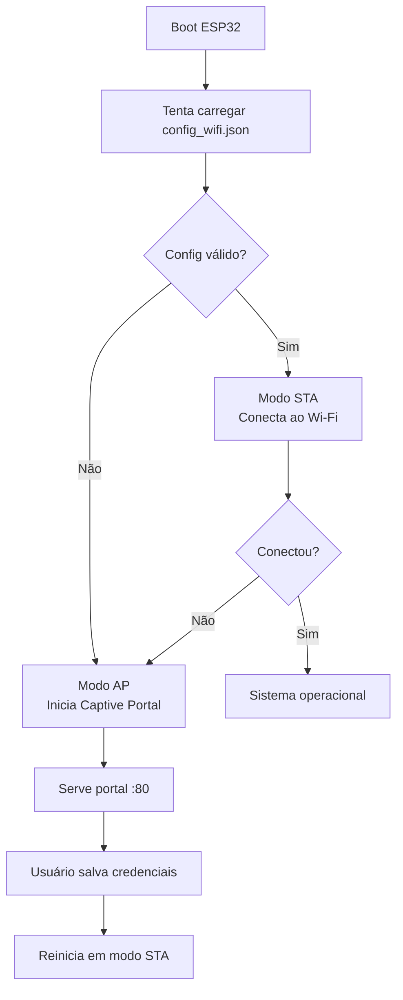

# Infraestrutura — Wi-Fi e Provisionamento

## Modos de Operação

Cada ESP32 (Matriz e Filial) opera em dois modos Wi-Fi:

| Modo    | Quando                  | Descrição                              |
| ------- | ----------------------- | -------------------------------------- |
| **STA** | Após provisionamento    | Conecta à rede Wi-Fi configurada       |
| **AP**  | Sem configuração válida | Cria rede própria para provisionamento |

### Boot Sequence



---

## Configuração Wi-Fi

### `config_wifi.json`

Armazenado no LittleFS de cada ESP32.

```json
{
    "mode": "sta",
    "ssid": "MinhaRede",
    "password": "senha123",
    "ap_ssid": "Matriz-Setup",
    "ap_password": "12345678"
}
```

| Campo         | Tipo   | Obrigatório | Descrição                         |
| ------------- | ------ | ----------- | --------------------------------- |
| `mode`        | string | Sim         | `"sta"`, `"ap"` ou `"sta+ap"`     |
| `ssid`        | string | Sim         | Nome da rede Wi-Fi (STA)          |
| `password`    | string | Sim         | Senha da rede (STA)               |
| `ap_ssid`     | string | Não         | SSID do AP                        |
| `ap_password` | string | Não         | Senha do AP (mínimo 8 caracteres) |

### Valores Padrão (Fallback)

| Parâmetro       | Valor               |
| --------------- | ------------------- |
| Timeout conexão | 10 segundos         |
| Modo padrão     | STA + AP            |
| hostname        | `matriz` / `filial` |

---

## Captive Portal

### Rede AP Padrão

| Parâmetro | Matriz         | Filial                    |
| --------- | -------------- | ------------------------- |
| SSID      | `Matriz-Setup` | `ESP32-<device_ip>-Setup` |
| Senha     | `12345678`     | `12345678`                |
| IP        | `192.168.4.1`  | `192.168.4.1`             |
| Porta     | `80`           | `80`                      |

#### Por que os SSIDs são diferentes?

- **Matriz**: Usa `Matriz-Setup` porque é um dispositivo único e identificado pelo nome "Matriz" — não há necessidade de desambiguação.
- **Filial**: Usa `ESP32-<device_ip>-Setup` porque há múltiplas Filiais na rede. O endereço IP no SSID permite identificar exatamente qual ESP32 está sendo configurado, evitandoconfusão em ambientes com várias Controladoras Filial.

### Endpoints do Portal

| Rota      | Método | Descrição                    |
| --------- | ------ | ---------------------------- |
| `/`       | GET    | Página de configuração Wi-Fi |
| `/save`   | POST   | Salva credenciais e reinicia |
| `/status` | GET    | Status da conexão            |

### Detecção Automática (Captive Portal)

O ESP32 responde a requisições de detecção de captive portal:

- **Apple**: `/hotspot-detect.html`
- **Android**: `/generate_204`
- **Windows**: `/ncsi.txt`

Todas redirecionam para a página de configuração (`/`).

---

## mDNS

A Matriz anuncia seu serviço via mDNS para descoberta pela GUI.

| Parâmetro | Valor                  |
| --------- | ---------------------- |
| Hostname  | `matriz.local`         |
| Serviço   | `_http._tcp`           |
| Porta     | `80`                   |
| WebSocket | `ws://matriz.local/ws` |

---

## Fluxo de Provisionamento Completo

1. **ESP32 boot** sem `config_wifi.json` válido
2. Entra em modo **AP** com SSID padrão (`Matriz-Setup` ou `ESP32-<ip>-Setup`)
3. Usuário conecta ao Wi-Fi do ESP32
4. Navegador redireciona automaticamente para o captive portal
5. Usuário preenche SSID e senha da rede local
6. ESP32 salva `config_wifi.json` no LittleFS
7. ESP32 reinicia em modo **STA**
8. Conecta à rede Wi-Fi configurada
9. Sistema operacional normal

> Para detalhes de rede e portas, veja [Infraestrutura → Rede](network.md).
