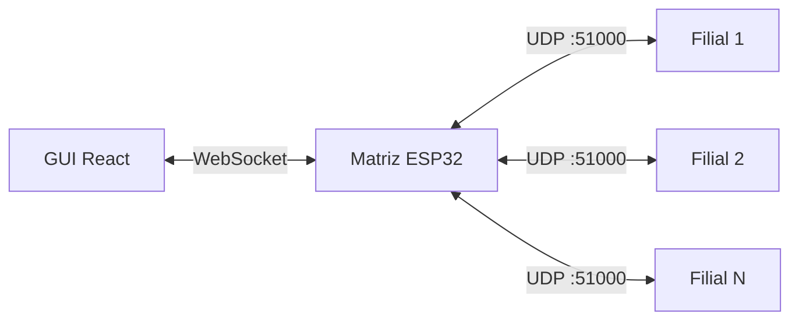

# Sistema de Monitoramento IoT

Sistema de monitoramento e controle de dispositivos IoT utilizando comunicação **UDP** entre ESP32s, com dashboard React via **WebSocket**.

## Componentes

| Componente | Função                                                           |
| ---------- | ---------------------------------------------------------------- |
| **Matriz** | Hub centralizador — gerencia filiais, serve GUI da Matriz        |
| **Filial** | Servidor UDP — controla dispositivos locais e serve Portal Local |
| **GUI**    | Dashboard React — monitoramento em tempo real (GUI da Matriz)    |

## Navegação

import DocCardList from '@theme/DocCardList';

<DocCardList />
